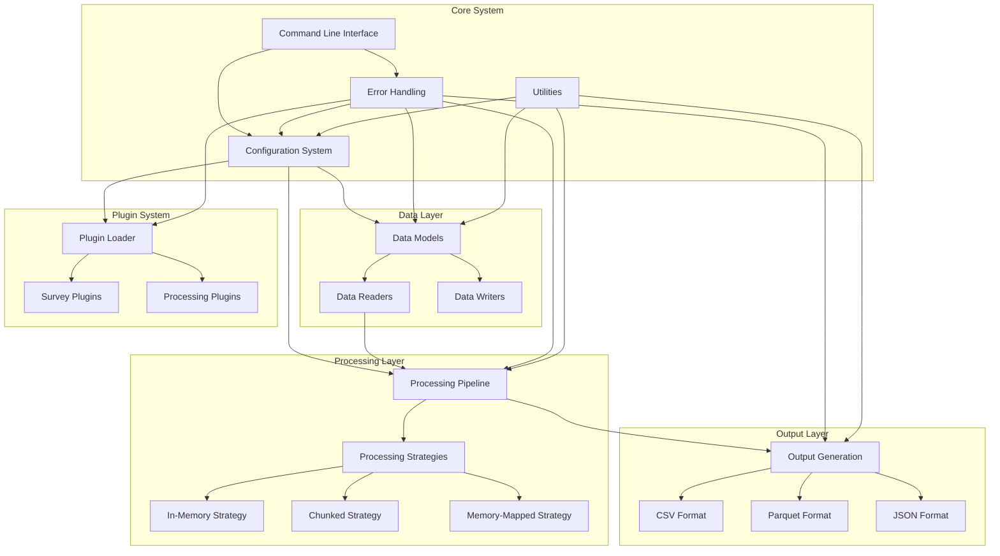
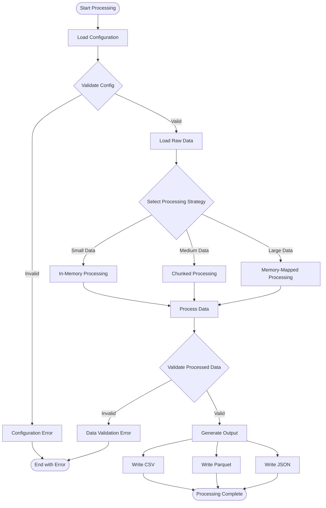

# Rusty BLS Data Processing System Documentation

Welcome to the comprehensive documentation for the Rusty BLS Data Processing system. This documentation provides detailed information about the system architecture, components, and workflows.

## System Overview

Rusty is a high-performance, modular data processing system designed specifically for Bureau of Labor Statistics (BLS) survey data. The system follows an interface-based architecture that provides flexibility, scalability, and maintainability for processing various BLS survey formats.

## Architecture Overview

The system is built around a modular, plugin-based architecture with the following core principles:

- **Interface-Based Design**: Components interact through well-defined trait interfaces
- **Modular Structure**: Clear separation of concerns with dedicated modules
- **Plugin Architecture**: Dynamic loading of survey-specific components
- **Configuration-Driven**: Behavior controlled by YAML configuration files
- **Performance Optimization**: Different processing strategies for different data sizes



## Key Features

### 🏗️ Modular Architecture
- Clean separation between data models, processing logic, and output generation
- Interface-based design for easy testing and extensibility
- Plugin system for survey-specific customizations

### ⚡ Performance Optimization
- Multiple processing strategies based on data size:
  - **In-Memory**: For small datasets (<100MB)
  - **Chunked**: For medium datasets (100MB-1GB)
  - **Memory-Mapped**: For large datasets (>1GB)

### 🔧 Configuration-Driven
- YAML-based configuration for all surveys
- Dynamic loading of survey-specific settings
- Flexible processing pipeline configuration

### 🛡️ Enterprise-Grade Error Handling
- Comprehensive error types for different components
- Error context and chaining for better debugging
- Security-aware error sanitization

### 📊 Multiple Output Formats
- CSV for compatibility and analysis
- Parquet for efficient storage and querying
- JSON for web applications and APIs

## Component Documentation

| Component | Description | Documentation |
|-----------|-------------|---------------|
| [Configuration](components/config/index.md) | Configuration loading and validation | Configuration system docs |
| [Data](components/data/index.md) | Data models, readers, and writers | Data handling docs |
| [Processing](components/processing/index.md) | Processing strategies and pipeline | Processing system docs |
| [Output](components/output/index.md) | Output generation and formatting | Output system docs |
| [Error](components/error/index.md) | Error handling and reporting | Error handling docs |
| [Plugin](components/plugin/index.md) | Plugin system and dynamic loading | Plugin system docs |
| [Utils](components/utils/index.md) | Utility functions and helpers | Utilities docs |

## Quick Start Guide

### 1. Installation and Setup

```bash
# Clone the repository
git clone <repository-url>
cd Rusty

# Build the project
cargo build --release
```

### 2. Basic Usage

```bash
# Process a survey with default settings
./target/release/rusty --survey AP --input data/raw/bls/ap/ --output data/processed/ap/

# Process with specific configuration
./target/release/rusty --config config/surveys/ap.yml --input data/raw/bls/ap/ --output data/processed/ap/
```

### 3. Configuration

Create a survey configuration file:

```yaml
# config/surveys/my_survey.yml
survey:
  code: "MS"
  name: "My Survey"
  description: "Custom survey processing"

processing:
  strategy: "in_memory"  # or "chunked", "mmap"
  max_threads: 4

output:
  formats: ["csv", "parquet"]
  compression: "gzip"
```

## Data Processing Workflow



## BLS Survey Support

The system supports processing of various BLS surveys, each with specific data formats and requirements:

- **AP** - Average Price Data
- **BD** - Business Dynamics Statistics
- **CE** - Current Employment Statistics
- **CU** - Consumer Price Index
- **And many more...**

Each survey has its own configuration file in `config/surveys/` that defines:
- Data file schemas
- Processing requirements
- Output specifications
- Validation rules

## Development Guidelines

### Adding New Surveys

1. Create configuration file in `config/surveys/[SURVEY_CODE]/`
2. Define data schemas and processing rules
3. Test with sample data
4. Update documentation

### Contributing

1. Follow the interface-based architecture
2. Write comprehensive tests
3. Update documentation
4. Follow Rust best practices

### Testing

```bash
# Run all tests
cargo test

# Run specific component tests
cargo test --test config_tests
cargo test --test data_tests
cargo test --test processing_tests
```

## Performance Considerations

### Memory Usage
- Use memory-mapped files for large datasets
- Implement chunked processing for medium datasets
- Monitor memory usage during processing

### Processing Speed
- Leverage parallel processing where possible
- Use appropriate data structures for the task
- Profile performance bottlenecks

### Storage Efficiency
- Use Parquet format for analytical workloads
- Apply compression for output files
- Consider partitioning strategies for large outputs

## Security Considerations

- Sanitize error messages to prevent information leakage
- Validate all input data and configurations
- Use secure file handling practices
- Implement proper access controls

## Monitoring and Observability

The system provides comprehensive monitoring capabilities:

- Error rate tracking and alerting
- Performance metrics collection
- Processing pipeline observability
- Resource usage monitoring

## Further Reading

- [BLS Data Documentation](../bls/README.md)
- [API Reference](../ref/README.md)
- [Development Guidelines](development.md)
- [Deployment Guide](deployment.md)

---

For questions or support, please refer to the component-specific documentation or create an issue in the project repository.