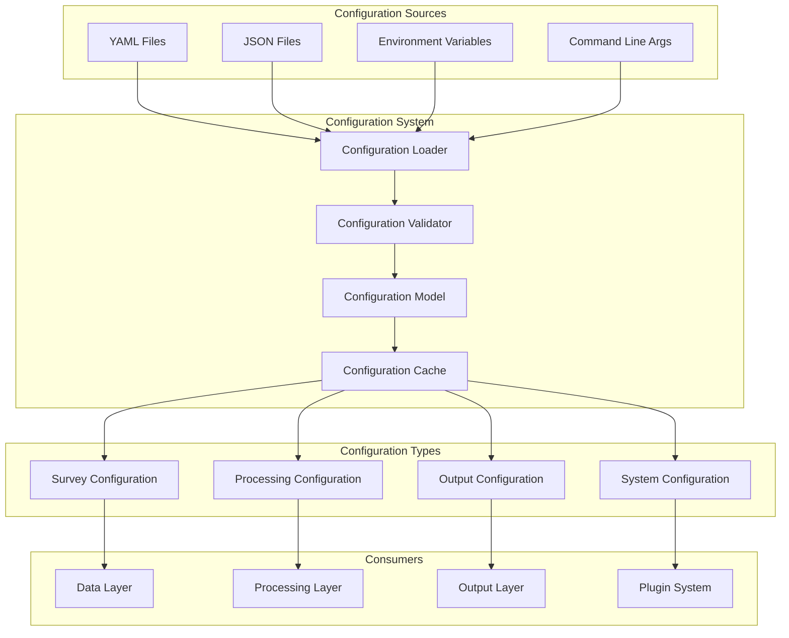
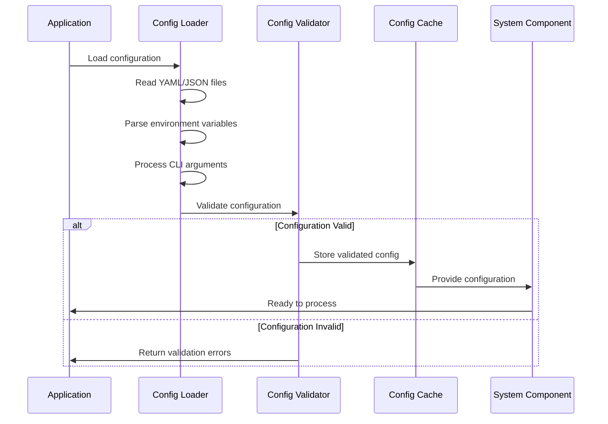
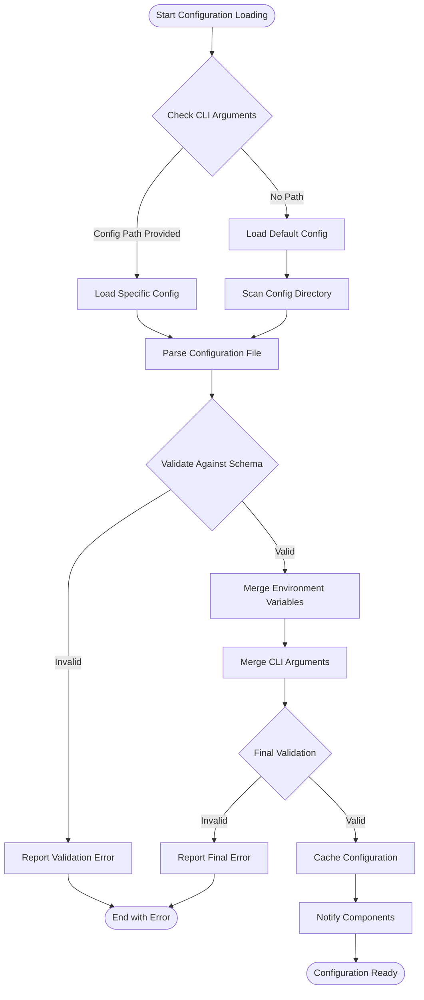

# Configuration System Documentation

Welcome to the Configuration System documentation for the Rusty BLS Data Processing system. This component handles all configuration loading, validation, and management across the system.

## Overview

The Configuration System is responsible for:
- Loading configuration files from various sources (YAML, JSON)
- Validating configuration data against schemas
- Providing configuration data to other components
- Managing survey-specific configurations
- Supporting dynamic configuration updates

## Architecture



## Configuration Flow



## Key Features

### 🔧 Multi-Format Support
- **YAML**: Primary configuration format for readability
- **JSON**: Alternative format for programmatic generation
- **Environment Variables**: Runtime configuration overrides
- **Command Line**: Quick configuration adjustments

### 🛡️ Validation and Schema
- Schema-based validation for all configuration types
- Type checking and constraint validation
- Detailed error reporting for invalid configurations
- Support for required and optional fields

### ⚡ Performance Optimization
- Configuration caching to avoid repeated parsing
- Lazy loading of survey-specific configurations
- Efficient memory usage for large configuration sets

### 🔄 Dynamic Updates
- Hot-reloading of configuration files
- Runtime configuration updates without restart
- Configuration change notifications to components

## Configuration Types

### Survey Configuration

Survey configurations define how to process specific BLS surveys:

```yaml
# config/surveys/AP/overview.yml
survey:
  code: "AP"
  name: "Average Price Data"
  description: "Consumer price data for selected items"
  version: "2024.1"
  
metadata:
  frequency: "monthly"
  geography: "national"
  seasonal_adjustment: true
  
files:
  series: "ap.series"
  data: "ap.data.*"
  area: "ap.area"
  item: "ap.item"
```

### Processing Configuration

Processing configurations control how data is processed:

```yaml
# config/surveys/AP/processing.yml
processing:
  strategy: "chunked"  # in_memory, chunked, mmap
  chunk_size: 10000
  max_threads: 4
  memory_limit: "2GB"
  
validation:
  strict_mode: true
  max_errors: 1000
  error_handling: "continue"  # continue, abort
  
transformations:
  - type: "normalize_dates"
  - type: "validate_numeric_ranges"
  - type: "apply_seasonal_adjustment"
```

### Output Configuration

Output configurations specify how processed data should be written:

```yaml
# config/surveys/AP/output.yml
output:
  formats:
    - type: "csv"
      compression: "gzip"
      delimiter: ","
    - type: "parquet"
      compression: "snappy"
      row_group_size: 50000
    - type: "json"
      compression: "gzip"
      pretty_print: false
      
partitioning:
  enabled: true
  columns: ["year", "period"]
  
metadata:
  include_schema: true
  include_statistics: true
```

## Configuration Loading Process



## Usage Examples

### Basic Configuration Loading

```rust
use crate::config::{ConfigLoader, ConfigError};

// Load configuration from default location
let config = ConfigLoader::new()
    .load_default()
    .await?;

// Load specific survey configuration
let survey_config = ConfigLoader::new()
    .load_survey("AP")
    .await?;

// Load with overrides
let config = ConfigLoader::new()
    .with_env_overrides()
    .with_cli_args(args)
    .load_survey("AP")
    .await?;
```

### Configuration Validation

```rust
use crate::config::{ConfigValidator, ValidationResult};

let validator = ConfigValidator::new();
let result = validator.validate(&config)?;

match result {
    ValidationResult::Valid => {
        println!("Configuration is valid");
    }
    ValidationResult::Invalid(errors) => {
        for error in errors {
            eprintln!("Validation error: {}", error);
        }
    }
}
```

## Integration with Other Components

The Configuration System integrates seamlessly with all other components:

- **Data Layer**: Provides file paths, schemas, and data validation rules
- **Processing Layer**: Specifies processing strategies and pipeline configuration
- **Output Layer**: Defines output formats, compression, and partitioning
- **Plugin System**: Manages plugin loading and configuration
- **Error Handling**: Provides error handling policies and logging configuration

## Best Practices

### Configuration Organization
- Use separate files for different configuration aspects
- Group related configurations in directories
- Use consistent naming conventions
- Document all configuration options

### Validation
- Always validate configurations before use
- Provide clear error messages for validation failures
- Use schema validation for type safety
- Test configurations with sample data

### Performance
- Cache frequently accessed configurations
- Use lazy loading for large configuration sets
- Monitor configuration loading performance
- Optimize file I/O operations

### Security
- Validate all configuration inputs
- Sanitize file paths and user inputs
- Use secure defaults for all options
- Audit configuration changes

## Testing

The Configuration System includes comprehensive tests:

- **Unit Tests**: Test individual configuration loading and validation functions
- **Integration Tests**: Test configuration loading with real files
- **Schema Tests**: Validate configuration schemas
- **Performance Tests**: Measure configuration loading performance

## Troubleshooting

### Common Issues

1. **Configuration File Not Found**
   - Check file paths and permissions
   - Verify configuration directory structure
   - Ensure files have correct extensions

2. **Validation Errors**
   - Review schema requirements
   - Check data types and formats
   - Validate required fields are present

3. **Performance Issues**
   - Enable configuration caching
   - Use lazy loading for large configs
   - Profile configuration loading times

## Contributing

When contributing to the configuration system:

1. Follow the existing configuration schema patterns
2. Add validation for new configuration options
3. Update documentation for new features
4. Write tests for configuration changes
5. Consider backward compatibility

## Further Reading

- [Configuration Schema Reference](schema.md)
- [Survey Configuration Guide](survey_config.md)
- [Environment Variables Reference](environment.md)
- [CLI Arguments Reference](cli_args.md)

---

For questions about configuration, please refer to the troubleshooting section or create an issue in the project repository.