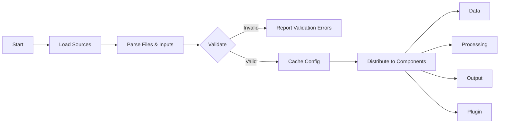

# Configuration Module: Tasks and Roadmap

This document outlines the planned tasks and roadmap for the Configuration module in the Rusty BLS Data Processing system. Use this page to quickly grasp how configuration flows through the system.

### At a Glance
- Sources: YAML, JSON, Env Vars, CLI
- Stages: Load → Parse → Validate → Cache → Provide
- Key concerns: Schema validation, hot reload, caching
- Status: Core Implementation phase

### Configuration Flow

## Current Status

The Configuration module is currently in the **Core Implementation** phase of the refactoring plan.

### Completed Tasks ✅

- Basic configuration model structures
- YAML configuration loading
- Configuration validation framework
- Survey-specific configuration support
- Environment variable integration

### In Progress Tasks 🔄

- Dynamic configuration updates and hot-reloading
- Configuration caching and performance optimization
- Enhanced validation with business rules
- Multi-format configuration support (JSON, TOML)

## Roadmap

### Phase 1: Foundation Enhancement (Weeks 1-2)

#### Task 1.1: Enhanced Configuration Models
- **Priority**: High
- **Effort**: 3 days
- **Description**: Expand configuration models with additional fields and validation
- **Deliverables**:
  - Enhanced `SurveyConfig` with metadata fields
  - Extended `ProcessingConfig` with strategy-specific options
  - Improved `OutputConfig` with format-specific settings

#### Task 1.2: Advanced Validation System
- **Priority**: High
- **Effort**: 4 days
- **Description**: Implement comprehensive validation with business rules
- **Deliverables**:
  - Cross-field validation rules
  - Custom validation functions
  - Detailed validation error reporting

#### Task 1.3: Configuration Schema System
- **Priority**: Medium
- **Effort**: 3 days
- **Description**: Implement JSON Schema-based validation
- **Deliverables**:
  - Schema definitions for all configuration types
  - Schema validation integration
  - Schema documentation generation

### Phase 2: Performance and Scalability (Weeks 3-4)

#### Task 2.1: Configuration Caching
- **Priority**: High
- **Effort**: 3 days
- **Description**: Implement intelligent configuration caching
- **Deliverables**:
  - Memory-efficient configuration cache
  - Cache invalidation strategies
  - Performance benchmarks

#### Task 2.2: Lazy Loading System
- **Priority**: Medium
- **Effort**: 2 days
- **Description**: Implement lazy loading for survey-specific configurations
- **Deliverables**:
  - On-demand configuration loading
  - Memory usage optimization
  - Loading performance metrics

#### Task 2.3: Configuration Compression
- **Priority**: Low
- **Effort**: 2 days
- **Description**: Implement configuration compression for large datasets
- **Deliverables**:
  - Compressed configuration storage
  - Transparent decompression
  - Size reduction metrics

### Phase 3: Advanced Features (Weeks 5-6)

#### Task 3.1: Hot Reloading
- **Priority**: High
- **Effort**: 4 days
- **Description**: Implement dynamic configuration updates without restart
- **Deliverables**:
  - File system monitoring
  - Configuration change detection
  - Component notification system

#### Task 3.2: Configuration Templates
- **Priority**: Medium
- **Effort**: 3 days
- **Description**: Implement reusable configuration templates
- **Deliverables**:
  - Template definition system
  - Template inheritance
  - Template validation

#### Task 3.3: Configuration Versioning
- **Priority**: Medium
- **Effort**: 3 days
- **Description**: Implement configuration version management
- **Deliverables**:
  - Version tracking system
  - Migration utilities
  - Backward compatibility support

### Phase 4: Integration and Testing (Weeks 7-8)

#### Task 4.1: Component Integration
- **Priority**: High
- **Effort**: 5 days
- **Description**: Integrate configuration system with all components
- **Deliverables**:
  - Data layer integration
  - Processing layer integration
  - Output layer integration
  - Plugin system integration

#### Task 4.2: Comprehensive Testing
- **Priority**: High
- **Effort**: 4 days
- **Description**: Implement comprehensive test suite
- **Deliverables**:
  - Unit tests for all components
  - Integration tests
  - Performance tests
  - Security tests

#### Task 4.3: Documentation and Examples
- **Priority**: Medium
- **Effort**: 3 days
- **Description**: Create comprehensive documentation and examples
- **Deliverables**:
  - API documentation
  - Configuration examples
  - Integration guides
  - Best practices documentation

## Technical Debt

### High Priority Technical Debt

1. **Configuration Error Handling**: Improve error messages and error context
2. **Memory Usage**: Optimize memory usage for large configuration files
3. **Validation Performance**: Optimize validation performance for complex rules

### Medium Priority Technical Debt

1. **Code Documentation**: Add comprehensive inline documentation
2. **Configuration Examples**: Create more comprehensive configuration examples
3. **Testing Coverage**: Increase test coverage to 95%+

## Dependencies

### Internal Dependencies
- Error handling module (for proper error reporting)
- Utilities module (for file and path operations)
- Plugin system (for plugin configuration support)

### External Dependencies
- `serde` and `serde_yaml` for serialization
- `validator` for validation rules
- `notify` for file system monitoring (hot reloading)
- `jsonschema` for schema validation

## Risk Assessment

### High Risk Items
- **Hot Reloading Complexity**: Dynamic configuration updates may introduce race conditions
- **Performance Impact**: Configuration validation may impact startup performance
- **Backward Compatibility**: Configuration format changes may break existing setups

### Mitigation Strategies
- Implement comprehensive testing for concurrent configuration updates
- Use configuration caching and lazy loading to minimize performance impact
- Maintain strict backward compatibility and provide migration tools

## Success Metrics

### Performance Metrics
- Configuration loading time < 100ms for typical configurations
- Memory usage < 10MB for large configuration sets
- Validation time < 50ms for complex configurations

### Quality Metrics
- Test coverage > 95%
- Zero critical security vulnerabilities
- Documentation coverage > 90%

### Usability Metrics
- Configuration error messages are clear and actionable
- Hot reloading works reliably in production
- Integration with other components is seamless

## Future Enhancements

### Long-term Goals
- **Configuration UI**: Web-based configuration management interface
- **Configuration Analytics**: Usage analytics and optimization recommendations
- **Cloud Integration**: Support for cloud-based configuration storage
- **Multi-tenant Support**: Support for multi-tenant configuration management

---

### Navigation
- [Docs Home](../../README.md)
- [Component Index](index.md)
- [Component README](README.md)
- [Test Specifications](test_specifications.md)
