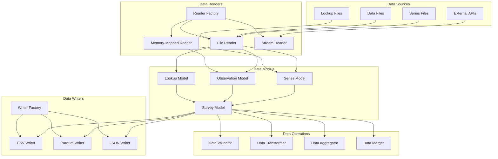
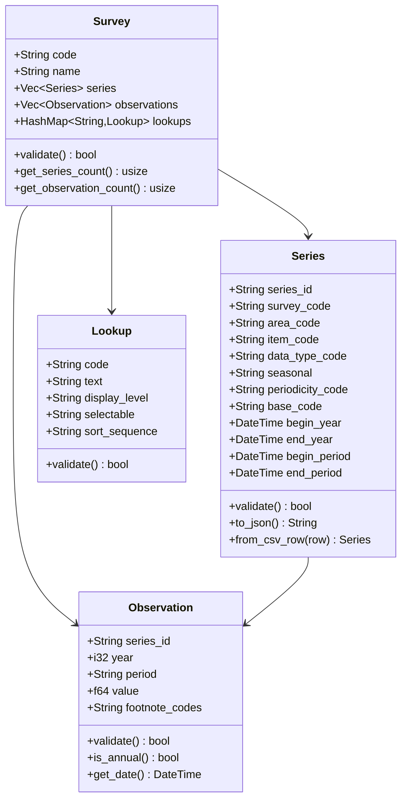
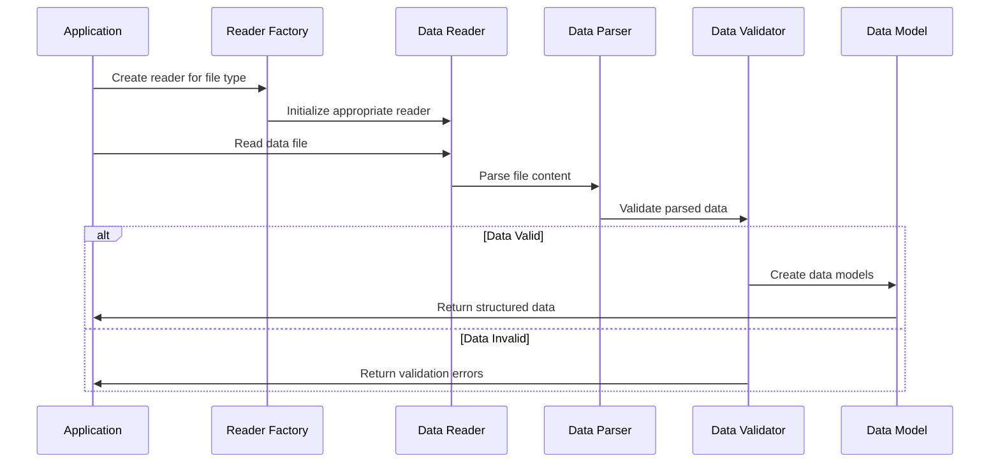
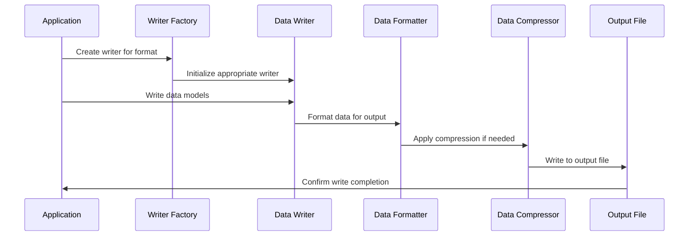
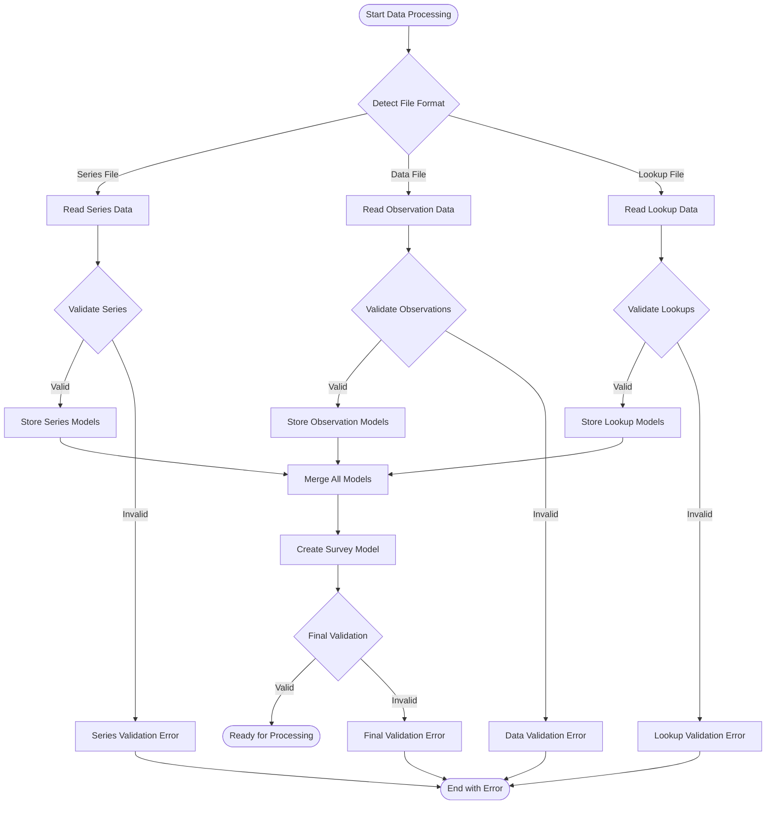
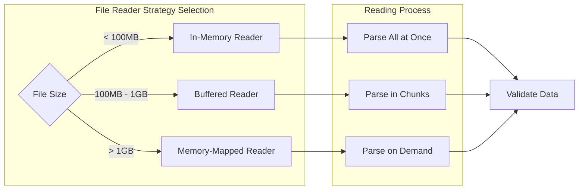
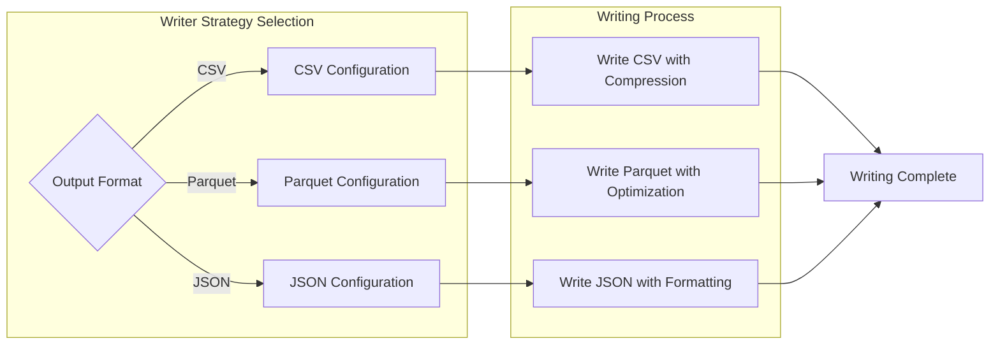
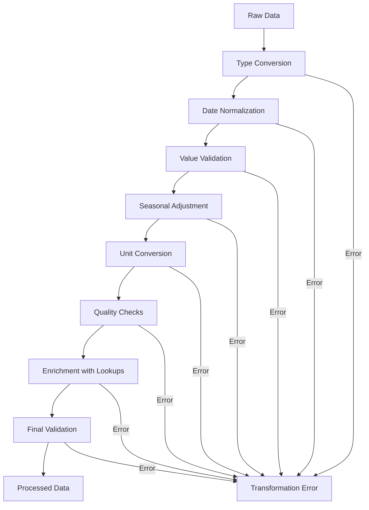

# Data Layer Documentation

Welcome to the Data Layer documentation for the Rusty BLS Data Processing system. This component handles all data models, reading, and writing operations across the system.

## Overview

The Data Layer is responsible for:
- Defining data models for BLS survey data (Series, Observations, Lookups)
- Reading data from various file formats and sources
- Writing processed data to multiple output formats
- Validating data integrity and consistency
- Managing data transformations and conversions

## Architecture

## Data Models

### Series Model

The Series model represents metadata about data series in BLS surveys:

## Data Reading Process

## Data Writing Process

## Key Features

### 🏗️ Flexible Data Models
- **Strongly Typed**: Type-safe data models with validation
- **Extensible**: Easy to add new fields and data types
- **Serializable**: Support for JSON, CSV, and binary formats
- **Validated**: Built-in data validation and consistency checks

### 📖 Multiple Reader Types
- **File Reader**: Standard file-based reading for small to medium files
- **Memory-Mapped Reader**: Efficient reading for large files
- **Stream Reader**: Real-time data processing from streams
- **Factory Pattern**: Automatic reader selection based on data size and type

### ✍️ Multiple Writer Types
- **CSV Writer**: Human-readable format for analysis
- **Parquet Writer**: Columnar format for efficient storage and querying
- **JSON Writer**: Web-friendly format for APIs
- **Factory Pattern**: Automatic writer selection based on configuration

### 🔍 Data Validation
- **Schema Validation**: Ensure data conforms to expected schemas
- **Range Validation**: Validate numeric values are within expected ranges
- **Consistency Validation**: Check data consistency across related records
- **Custom Validation**: Support for survey-specific validation rules

## Data Flow Architecture

## Reader Implementations

### File Reader Strategy

### Writer Strategy Selection

## Data Transformation Pipeline

## Performance Optimization

### Memory Management

The Data Layer implements several memory optimization strategies:

- **Lazy Loading**: Load data only when needed
- **Memory Pooling**: Reuse memory allocations for similar data structures
- **Streaming Processing**: Process large datasets without loading everything into memory
- **Compression**: Use compressed data structures where appropriate

### I/O Optimization

- **Parallel Reading**: Read multiple files concurrently
- **Buffered I/O**: Use appropriate buffer sizes for different file types
- **Memory Mapping**: Use memory-mapped files for large datasets
- **Async Operations**: Non-blocking I/O operations where possible

## Integration with Other Components

### Configuration Integration
The Data Layer receives configuration from the Configuration System:
- File paths and naming patterns
- Data validation rules and thresholds
- Reader and writer preferences
- Performance tuning parameters

### Processing Integration
The Data Layer provides data to the Processing System:
- Structured data models ready for processing
- Data validation results and quality metrics
- Metadata about data characteristics
- Processing hints and recommendations

### Error Handling Integration
The Data Layer integrates with the Error Handling System:
- Detailed error reporting for data issues
- Context information for debugging
- Error recovery strategies
- Data quality metrics and alerts

## Testing Strategy

### Unit Tests
- Test individual data model validation
- Test reader and writer functionality
- Test data transformation operations
- Test error handling scenarios

### Integration Tests
- Test end-to-end data processing workflows
- Test with real BLS data files
- Test performance with large datasets
- Test error recovery mechanisms

### Performance Tests
- Benchmark reading and writing operations
- Test memory usage with large datasets
- Test concurrent processing capabilities
- Validate optimization strategies

## Best Practices

### Data Modeling
- Use strong typing for all data fields
- Implement comprehensive validation
- Design for extensibility and evolution
- Document data relationships clearly

### Performance
- Choose appropriate reader/writer strategies
- Monitor memory usage and optimize accordingly
- Use parallel processing where beneficial
- Profile and optimize critical paths

### Error Handling
- Validate data at multiple stages
- Provide detailed error messages
- Implement graceful error recovery
- Log data quality issues for analysis

### Security
- Validate all input data
- Sanitize data before processing
- Protect against malformed data attacks
- Audit data access and modifications

## Troubleshooting

### Common Issues

1. **Memory Issues with Large Files**
   - Use memory-mapped readers for files > 1GB
   - Enable streaming processing
   - Monitor memory usage during processing

2. **Data Validation Failures**
   - Check data format specifications
   - Verify field types and ranges
   - Review validation rules configuration

3. **Performance Issues**
   - Profile I/O operations
   - Check for memory leaks
   - Optimize data structures
   - Use appropriate concurrency levels

## Contributing

When contributing to the Data Layer:

1. Follow the existing data model patterns
2. Add comprehensive validation for new data types
3. Write tests for all data operations
4. Update documentation for new features
5. Consider performance implications of changes

## Further Reading

- [Data Model Reference](models.md)
- [Reader Implementation Guide](readers.md)
- [Writer Implementation Guide](writers.md)
- [Performance Tuning Guide](performance.md)

---

For questions about the Data Layer, please refer to the troubleshooting section or create an issue in the project repository.