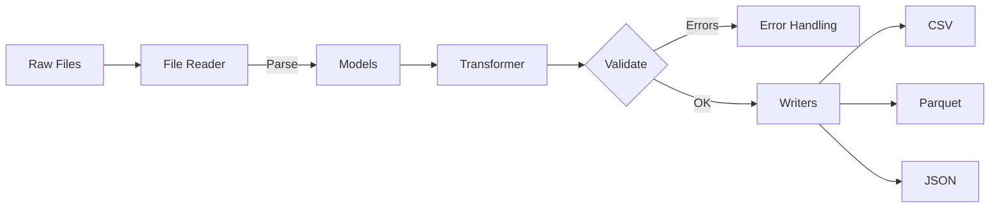

# Data Module: Tasks and Roadmap

This document outlines the planned tasks and roadmap for the Data module. This page shows the end-to-end data flow to help you navigate quickly.

### At a Glance
- Models: Series, Observation, Lookup, Survey
- Readers: File, Mmap (planned), Streaming (planned)
- Writers: CSV, Parquet, JSON
- Status: Core Implementation phase

### Data Flow

## Current Status

The Data module is currently in the **Core Implementation** phase.

### Completed Tasks ✅
- Basic data model structures (Series, Observation, Lookup, Survey)
- File-based data reading capabilities
- CSV and basic output writing
- Data validation framework

### In Progress Tasks 🔄
- Memory-mapped file reading for large datasets
- Parquet format support
- Streaming data processing
- Advanced data validation rules

## Roadmap

### Phase 1: Enhanced Data Models (Weeks 1-2)
#### Task 1.1: Extended Data Models
- **Priority**: High
- **Effort**: 3 days
- **Deliverables**: Enhanced Series and Observation models with metadata

#### Task 1.2: Data Validation System
- **Priority**: High
- **Effort**: 4 days
- **Deliverables**: Comprehensive data validation with business rules

### Phase 2: Performance Optimization (Weeks 3-4)
#### Task 2.1: Memory-Mapped Reading
- **Priority**: High
- **Effort**: 5 days
- **Deliverables**: MmapReader implementation for large files

#### Task 2.2: Streaming Processing
- **Priority**: Medium
- **Effort**: 4 days
- **Deliverables**: Stream-based data processing capabilities

### Phase 3: Advanced Formats (Weeks 5-6)
#### Task 3.1: Parquet Support
- **Priority**: High
- **Effort**: 4 days
- **Deliverables**: ParquetWriter and ParquetReader implementations

#### Task 3.2: JSON Support
- **Priority**: Medium
- **Effort**: 2 days
- **Deliverables**: JsonWriter implementation

### Phase 4: Integration and Testing (Weeks 7-8)
#### Task 4.1: Component Integration
- **Priority**: High
- **Effort**: 5 days
- **Deliverables**: Full integration with processing and output components

#### Task 4.2: Performance Testing
- **Priority**: High
- **Effort**: 3 days
- **Deliverables**: Performance benchmarks and optimization

## Technical Debt
- **Memory Usage**: Optimize memory usage for large datasets
- **Error Handling**: Improve error messages and context
- **Documentation**: Add comprehensive inline documentation

## Dependencies
- **Internal**: Error handling, Configuration, Utilities modules
- **External**: `serde`, `arrow`, `parquet`, `memmap2`

## Success Metrics
- **Performance**: Read/write speeds > 100MB/s
- **Memory**: Memory usage < 1GB for 10GB datasets
- **Quality**: Test coverage > 95%

---

### Navigation
- [Docs Home](../../README.md)
- [Component Index](index.md)
- [Component README](README.md)
- [Test Specifications](test_specifications.md)
