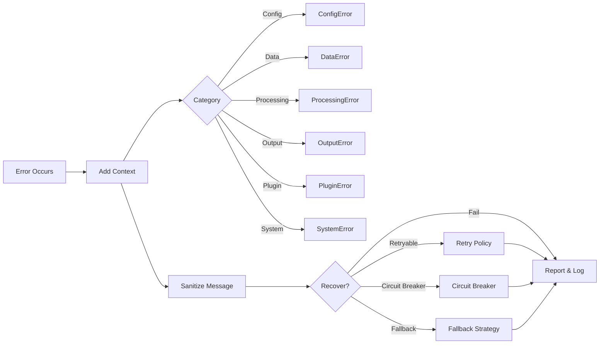

# Error Handling Module: Tasks and Roadmap

This document outlines the tasks and roadmap for the Error Handling module of the Rusty BLS Data Processing system. The visuals below summarize how errors flow through the system.

### At a Glance
- Error types: Config, Data, Processing, Output, Plugin, System
- Capabilities: Context, Chaining, Sanitization, Recovery, Telemetry
- Resilience: Retries, Circuit Breakers, Health Monitoring

### Error Flow

## Current Status

The Error Handling module currently provides:

- A comprehensive error type hierarchy
- Error context functionality with location tracking
- Traits for adding context to `Result` and `Option` types
- Legacy error support for backward compatibility

## Planned Tasks

### Short-term Tasks (1-2 Weeks)

1. **Documentation Enhancement**
   - [ ] Add more examples to the module-level documentation
   - [ ] Create usage examples for each error type
   - [ ] Document best practices for error handling in the application

2. **Error Reporting Improvements**
   - [ ] Implement structured error logging
   - [ ] Add support for error codes
   - [ ] Enhance error messages with more context

3. **Testing Enhancements**
   - [ ] Increase test coverage for error types
   - [ ] Add property-based tests for error conversions
   - [ ] Create integration tests for error handling across components

### Medium-term Tasks (1-2 Months)

4. **Error Recovery Mechanisms**
   - [ ] Implement retry mechanisms for recoverable errors
   - [ ] Add circuit breaker patterns for external service calls
   - [ ] Create a recovery strategy framework

5. **Error Aggregation**
   - [ ] Implement error aggregation for batch operations
   - [ ] Add support for reporting multiple errors at once
   - [ ] Create utilities for summarizing error patterns

6. **Internationalization Support**
   - [ ] Add support for translatable error messages
   - [ ] Implement locale-aware error formatting
   - [ ] Create a message catalog system

### Long-term Tasks (3+ Months)

7. **Error Telemetry**
   - [ ] Implement error metrics collection
   - [ ] Add support for error tracing across components
   - [ ] Create dashboards for error monitoring

8. **Advanced Error Analysis**
   - [ ] Implement error pattern recognition
   - [ ] Add support for automated error categorization
   - [ ] Create tools for error trend analysis

9. **Error Handling Policy Framework**
   - [ ] Implement configurable error handling policies
   - [ ] Add support for environment-specific error behaviors
   - [ ] Create a policy enforcement mechanism

## Implementation Priorities

1. Focus on documentation and testing enhancements first
2. Implement error reporting improvements next
3. Add error recovery mechanisms as needed
4. Implement error aggregation for batch processing
5. Add internationalization support for global deployment
6. Develop error telemetry for production monitoring
7. Implement advanced error analysis for ongoing improvement
8. Create an error handling policy framework for enterprise deployments

## Performance Considerations

- Minimize allocations in error handling paths
- Use static strings where possible to reduce memory usage
- Consider using small string optimization for error messages
- Avoid deep error chains that could impact performance
- Use error codes for compact error representation
- Consider using error pools for high-frequency error scenarios

## Security Considerations

- Avoid exposing sensitive information in error messages
- Implement proper error sanitization for external reporting
- Consider using error redaction for security-sensitive contexts
- Implement proper error isolation between components
- Add support for security-related error auditing
- Consider implementing error rate limiting to prevent DoS attacks

---

### Navigation
- [Docs Home](../../README.md)
- [Component Index](index.md)
- [Component README](README.md)
- [Test Specifications](test_specifications.md)
