# Components Documentation Index

This index provides a single place to jump into each component’s detailed docs, tasks/roadmaps, and test specifications.

## Visual Components Map

```mermaid
graph TB
    subgraph Components
        C[Configuration]
        D[Data]
        P[Processing]
        O[Output]
        E[Error]
        PL[Plugin]
        U[Utils]
    end

    C --> CDocs[Docs]
    C --> CTasks[Tasks]
    C --> CTests[Tests]

    D --> DDocs[Docs]
    D --> DTasks[Tasks]
    D --> DTests[Tests]

    P --> PDocs[Docs]
    P --> PTasks[Tasks]
    P --> PTests[Tests]

    O --> ODocs[Docs]
    O --> OTasks[Tasks]
    O --> OTests[Tests]

    E --> EDocs[Docs]
    E --> ETasks[Tasks]
    E --> ETests[Tests]

    PL --> PLDocs[Docs]
    PL --> PLTasks[Tasks]
    PL --> PLTests[Tests]

    U --> UDocs[Docs]
    U --> UTasks[Tasks]
    U --> UTests[Tests]

    click CDocs "config/index.md" "Open Configuration Docs"
    click CTasks "config/tasks.md" "Open Configuration Tasks"
    click CTests "config/test_specifications.md" "Open Configuration Test Specs"

    click DDocs "data/index.md" "Open Data Docs"
    click DTasks "data/tasks.md" "Open Data Tasks"
    click DTests "data/test_specifications.md" "Open Data Test Specs"

    click PDocs "processing/index.md" "Open Processing Docs"
    click PTasks "processing/tasks.md" "Open Processing Tasks"
    click PTests "processing/test_specifications.md" "Open Processing Test Specs"

    click ODocs "output/index.md" "Open Output Docs"
    click OTasks "output/tasks.md" "Open Output Tasks"
    click OTests "output/test_specifications.md" "Open Output Test Specs"

    click EDocs "error/index.md" "Open Error Docs"
    click ETasks "error/tasks.md" "Open Error Tasks"
    click ETests "error/test_specifications.md" "Open Error Test Specs"

    click PLDocs "plugin/index.md" "Open Plugin Docs"
    click PLTasks "plugin/tasks.md" "Open Plugin Tasks"
    click PLTests "plugin/test_specifications.md" "Open Plugin Test Specs"

    click UDocs "utils/index.md" "Open Utils Docs"
    click UTasks "utils/tasks.md" "Open Utils Tasks"
    click UTests "utils/test_specifications.md" "Open Utils Test Specs"
```

## Quick Links
- Configuration: [Docs](config/index.md) • [Tasks](config/tasks.md) • [Tests](config/test_specifications.md)
- Data: [Docs](data/index.md) • [Tasks](data/tasks.md) • [Tests](data/test_specifications.md)
- Processing: [Docs](processing/index.md) • [Tasks](processing/tasks.md) • [Tests](processing/test_specifications.md)
- Output: [Docs](output/index.md) • [Tasks](output/tasks.md) • [Tests](output/test_specifications.md)
- Error: [Docs](error/index.md) • [Tasks](error/tasks.md) • [Tests](error/test_specifications.md)
- Plugin: [Docs](plugin/index.md) • [Tasks](plugin/tasks.md) • [Tests](plugin/test_specifications.md)
- Utils: [Docs](utils/index.md) • [Tasks](utils/tasks.md) • [Tests](utils/test_specifications.md)

---

### Navigation
- [Docs Home](../index.md)
- [System Overview](../README.md)
