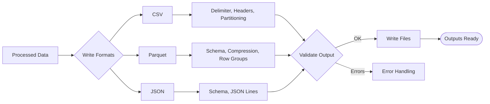

# Output Module: Tasks and Roadmap

This document outlines the planned tasks and roadmap for the Output module. This page provides a quick visual of how output generation works.

### At a Glance
- Formats: CSV, Parquet, JSON
- Options: Partitioning, Compression, Schema
- Validation: Output schema and quality checks
- Status: Core Implementation phase

### Output Flow

## Current Status

The Output module is currently in the **Core Implementation** phase.

### Completed Tasks ✅
- Basic output format interfaces
- CSV format implementation
- File-based output writing
- Output configuration framework

### In Progress Tasks 🔄
- Parquet format implementation
- JSON format implementation
- Streaming output capabilities
- Output validation framework

## Roadmap

### Phase 1: Format Implementation (Weeks 1-2)
#### Task 1.1: Parquet Format Support
- **Priority**: High
- **Effort**: 5 days
- **Deliverables**: Complete Parquet format implementation with compression

#### Task 1.2: JSON Format Support
- **Priority**: Medium
- **Effort**: 3 days
- **Deliverables**: JSON format implementation with schema validation

### Phase 2: Advanced Features (Weeks 3-4)
#### Task 2.1: Streaming Output
- **Priority**: High
- **Effort**: 4 days
- **Deliverables**: Streaming output capabilities for large datasets

#### Task 2.2: Output Validation
- **Priority**: High
- **Effort**: 3 days
- **Deliverables**: Comprehensive output validation framework

### Phase 3: Performance Optimization (Weeks 5-6)
#### Task 3.1: Parallel Output Generation
- **Priority**: Medium
- **Effort**: 4 days
- **Deliverables**: Multi-threaded output generation

#### Task 3.2: Compression Support
- **Priority**: Medium
- **Effort**: 3 days
- **Deliverables**: Compression options for all output formats

### Phase 4: Integration and Testing (Weeks 7-8)
#### Task 4.1: Component Integration
- **Priority**: High
- **Effort**: 5 days
- **Deliverables**: Full integration with processing and configuration components

#### Task 4.2: Performance Testing
- **Priority**: High
- **Effort**: 3 days
- **Deliverables**: Performance benchmarks and optimization

## Technical Debt
- **Error Handling**: Improve error messages and recovery
- **Memory Usage**: Optimize memory usage for large outputs
- **Documentation**: Add comprehensive inline documentation

## Dependencies
- **Internal**: Data, Processing, Configuration, Error handling modules
- **External**: `arrow`, `parquet`, `serde_json`, `csv`, `flate2`

## Success Metrics
- **Performance**: Generate 1M records/minute for CSV format
- **Memory**: Memory usage < 500MB for 1GB output files
- **Quality**: Test coverage > 95%
- **Formats**: Support CSV, Parquet, JSON with full feature parity

## Risk Assessment
- **Format Compatibility**: Different format requirements may conflict
- **Performance**: Large output generation may impact system performance
- **Validation**: Complex validation rules may slow output generation

## Mitigation Strategies
- Use format-specific optimization strategies
- Implement streaming and chunked output for large datasets
- Provide configurable validation levels (strict, normal, minimal)

---

### Navigation
- [Docs Home](../../README.md)
- [Component Index](index.md)
- [Component README](README.md)
- [Test Specifications](test_specifications.md)
