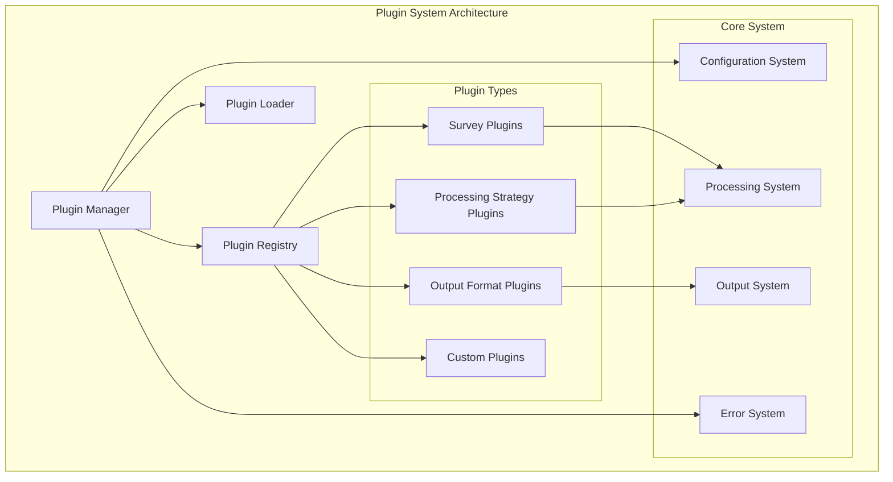
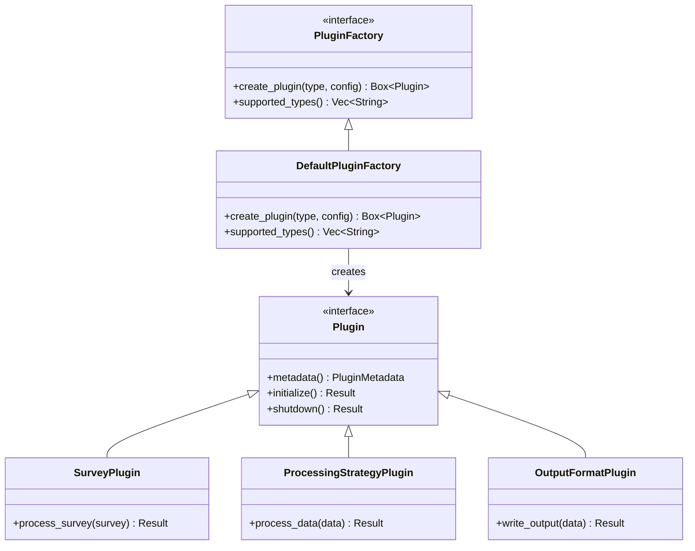
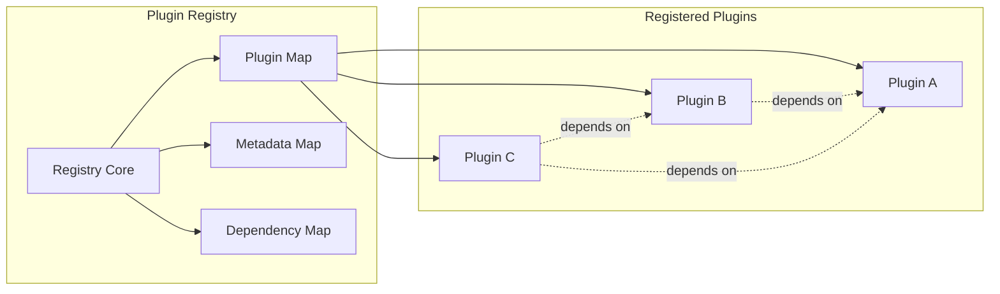
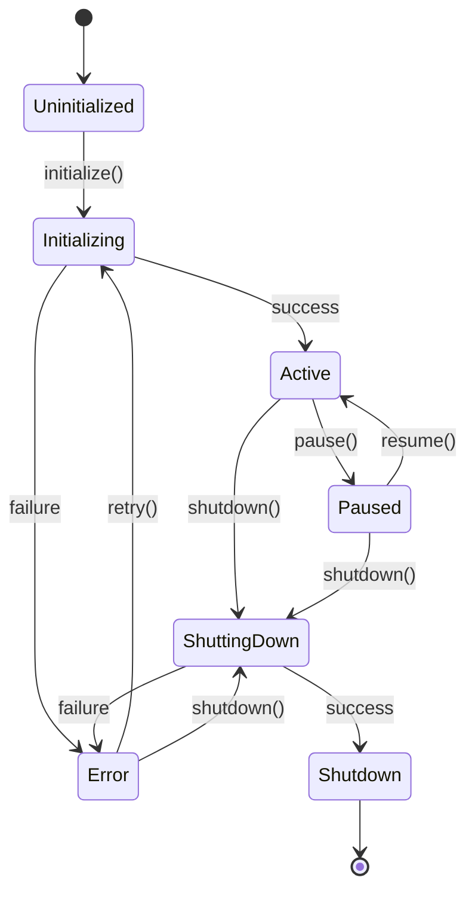
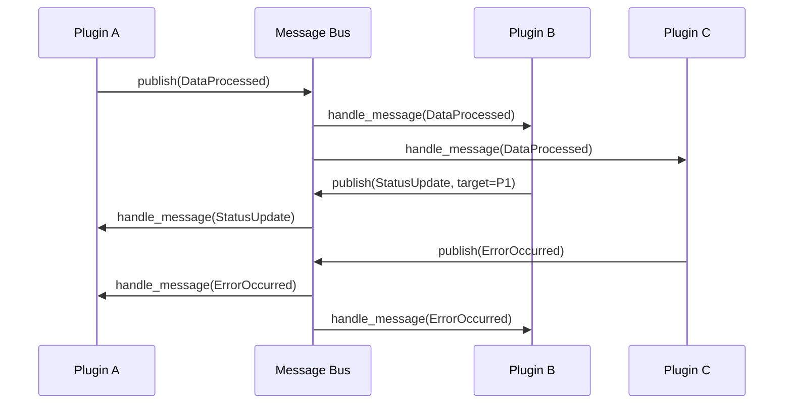
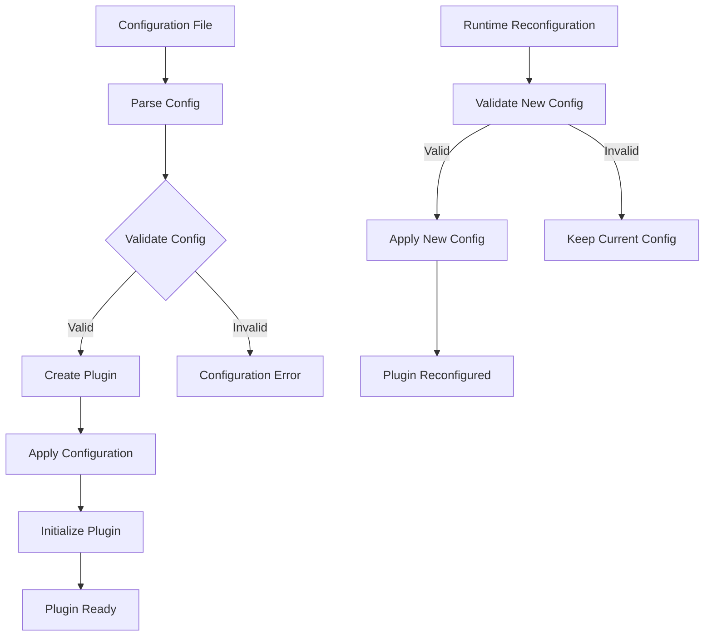
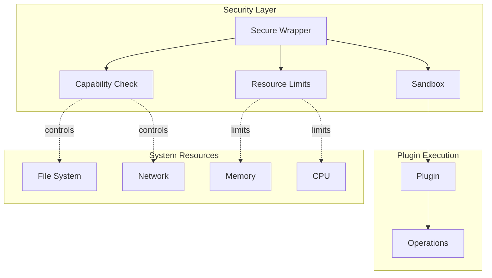
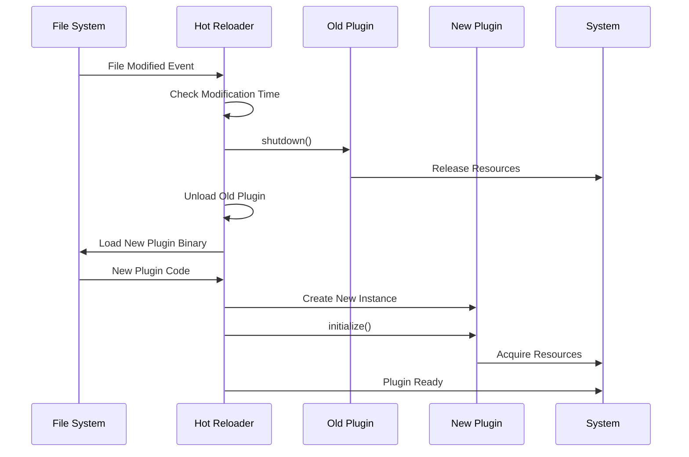
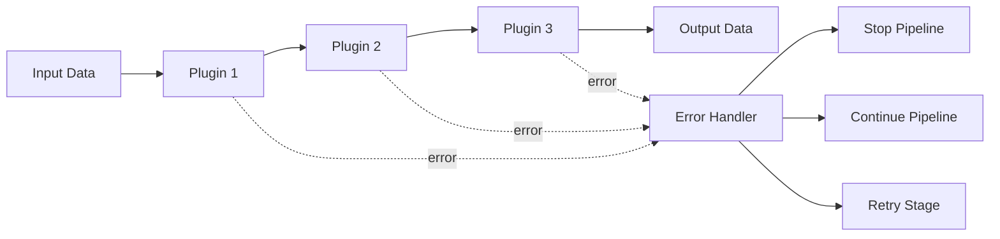

# Plugin Module: Design Patterns

This document outlines recommended design patterns for implementing and extending the Plugin module in the Rusty BLS Data Processing system.

## Plugin Architecture Overview

The Plugin system follows a modular, extensible architecture that supports dynamic loading and hot-swapping of components:



## Core Design Patterns

### 1. Plugin Factory Pattern

Use the Factory pattern to create plugins dynamically:

```rust
pub trait PluginFactory {
    fn create_plugin(&self, plugin_type: &str, config: &PluginConfig) -> Result<Box<dyn Plugin>>;
    fn supported_types(&self) -> Vec<String>;
}

pub struct DefaultPluginFactory;

impl PluginFactory for DefaultPluginFactory {
    fn create_plugin(&self, plugin_type: &str, config: &PluginConfig) -> Result<Box<dyn Plugin>> {
        match plugin_type {
            "survey" => Ok(Box::new(SurveyPlugin::new(config)?)),
            "processing_strategy" => Ok(Box::new(ProcessingStrategyPlugin::new(config)?)),
            "output_format" => Ok(Box::new(OutputFormatPlugin::new(config)?)),
            _ => Err(PluginError::UnsupportedPluginType(plugin_type.to_string()).into()),
        }
    }
    
    fn supported_types(&self) -> Vec<String> {
        vec![
            "survey".to_string(),
            "processing_strategy".to_string(),
            "output_format".to_string(),
        ]
    }
}
```

**Plugin Factory Architecture:**



### 2. Plugin Registry Pattern

Implement a centralized registry for plugin management:

```rust
pub struct PluginRegistry {
    plugins: HashMap<String, Box<dyn Plugin>>,
    metadata: HashMap<String, PluginMetadata>,
    dependencies: HashMap<String, Vec<String>>,
}

impl PluginRegistry {
    pub fn new() -> Self {
        Self {
            plugins: HashMap::new(),
            metadata: HashMap::new(),
            dependencies: HashMap::new(),
        }
    }
    
    pub fn register(&mut self, plugin: Box<dyn Plugin>) -> Result<()> {
        let metadata = plugin.metadata();
        let name = metadata.name.clone();
        
        // Validate dependencies
        self.validate_dependencies(&metadata)?;
        
        // Store plugin and metadata
        self.metadata.insert(name.clone(), metadata.clone());
        self.dependencies.insert(name.clone(), metadata.dependencies.clone());
        self.plugins.insert(name, plugin);
        
        Ok(())
    }
    
    pub fn get_plugin(&self, name: &str) -> Option<&dyn Plugin> {
        self.plugins.get(name).map(|p| p.as_ref())
    }
    
    pub fn initialize_all(&mut self) -> Result<()> {
        // Initialize plugins in dependency order
        let initialization_order = self.resolve_dependency_order()?;
        
        for plugin_name in initialization_order {
            if let Some(plugin) = self.plugins.get_mut(&plugin_name) {
                plugin.initialize()
                    .with_context(format!("Failed to initialize plugin: {}", plugin_name))?;
            }
        }
        
        Ok(())
    }
}
```

**Plugin Registry Architecture:**



### 3. Plugin Lifecycle Pattern

Implement a comprehensive lifecycle management pattern:

```rust
#[derive(Debug, Clone, PartialEq)]
pub enum PluginState {
    Uninitialized,
    Initializing,
    Active,
    Paused,
    Shutting Down,
    Shutdown,
    Error(String),
}

pub trait PluginLifecycle {
    fn state(&self) -> PluginState;
    fn initialize(&mut self) -> Result<()>;
    fn pause(&mut self) -> Result<()>;
    fn resume(&mut self) -> Result<()>;
    fn shutdown(&mut self) -> Result<()>;
    fn health_check(&self) -> Result<PluginHealth>;
}

pub struct ManagedPlugin {
    plugin: Box<dyn Plugin>,
    state: PluginState,
    last_health_check: Option<Instant>,
    error_count: usize,
}

impl PluginLifecycle for ManagedPlugin {
    fn state(&self) -> PluginState {
        self.state.clone()
    }
    
    fn initialize(&mut self) -> Result<()> {
        if self.state != PluginState::Uninitialized {
            return Ok(());
        }
        
        self.state = PluginState::Initializing;
        
        match self.plugin.initialize() {
            Ok(()) => {
                self.state = PluginState::Active;
                self.error_count = 0;
                Ok(())
            }
            Err(e) => {
                self.state = PluginState::Error(e.to_string());
                self.error_count += 1;
                Err(e)
            }
        }
    }
}
```

**Plugin Lifecycle State Machine:**



### 4. Plugin Communication Pattern

Implement a message-based communication system:

```rust
#[derive(Debug, Clone)]
pub struct PluginMessage {
    pub sender: String,
    pub receiver: Option<String>, // None for broadcast
    pub message_type: String,
    pub payload: MessagePayload,
    pub timestamp: Instant,
}

#[derive(Debug, Clone)]
pub enum MessagePayload {
    DataProcessed { survey_code: String, record_count: usize },
    ErrorOccurred { error_message: String, severity: ErrorSeverity },
    StatusUpdate { status: String, details: HashMap<String, String> },
    Custom(serde_json::Value),
}

pub trait MessageHandler {
    fn handle_message(&mut self, message: PluginMessage) -> Result<()>;
    fn message_types(&self) -> Vec<String>;
}

pub struct MessageBus {
    subscribers: HashMap<String, Vec<String>>, // message_type -> plugin_names
    handlers: HashMap<String, Box<dyn MessageHandler>>,
}

impl MessageBus {
    pub fn subscribe(&mut self, plugin_name: String, message_type: String) -> Result<()> {
        self.subscribers
            .entry(message_type)
            .or_insert_with(Vec::new)
            .push(plugin_name);
        Ok(())
    }
    
    pub fn publish(&mut self, message: PluginMessage) -> Result<()> {
        let subscribers = match &message.receiver {
            Some(receiver) => vec![receiver.clone()],
            None => self.subscribers
                .get(&message.message_type)
                .cloned()
                .unwrap_or_default(),
        };
        
        for subscriber in subscribers {
            if let Some(handler) = self.handlers.get_mut(&subscriber) {
                handler.handle_message(message.clone())?;
            }
        }
        
        Ok(())
    }
}
```

**Plugin Communication Architecture:**



### 5. Plugin Configuration Pattern

Implement a flexible configuration system:

```rust
#[derive(Debug, Clone, Deserialize)]
pub struct PluginConfig {
    pub name: String,
    pub version: String,
    pub enabled: bool,
    pub priority: i32,
    pub parameters: HashMap<String, serde_json::Value>,
    pub dependencies: Vec<String>,
    pub capabilities: Vec<String>,
}

pub trait Configurable {
    type Config: DeserializeOwned;
    
    fn configure(&mut self, config: Self::Config) -> Result<()>;
    fn get_config(&self) -> Self::Config;
    fn validate_config(config: &Self::Config) -> Result<()>;
}

pub struct ConfigurablePlugin<T: Configurable> {
    plugin: T,
    config: T::Config,
}

impl<T: Configurable> ConfigurablePlugin<T> {
    pub fn new(mut plugin: T, config: T::Config) -> Result<Self> {
        T::validate_config(&config)?;
        plugin.configure(config.clone())?;
        
        Ok(Self { plugin, config })
    }
    
    pub fn reconfigure(&mut self, new_config: T::Config) -> Result<()> {
        T::validate_config(&new_config)?;
        self.plugin.configure(new_config.clone())?;
        self.config = new_config;
        Ok(())
    }
}
```

**Plugin Configuration Flow:**



### 6. Plugin Security Pattern

Implement security controls for plugin execution:

```rust
pub struct SecurePluginWrapper {
    plugin: Box<dyn Plugin>,
    capabilities: HashSet<String>,
    resource_limits: ResourceLimits,
    sandbox: PluginSandbox,
}

#[derive(Debug, Clone)]
pub struct ResourceLimits {
    pub max_memory: usize,
    pub max_cpu_time: Duration,
    pub max_file_handles: usize,
    pub allowed_paths: Vec<PathBuf>,
}

impl SecurePluginWrapper {
    pub fn new(plugin: Box<dyn Plugin>, limits: ResourceLimits) -> Result<Self> {
        let metadata = plugin.metadata();
        let capabilities = metadata.capabilities.into_iter().collect();
        let sandbox = PluginSandbox::new(&limits)?;
        
        Ok(Self {
            plugin,
            capabilities,
            resource_limits: limits,
            sandbox,
        })
    }
    
    pub fn execute_with_security<F, R>(&self, operation: F) -> Result<R>
    where
        F: FnOnce() -> Result<R>,
    {
        // Set resource limits
        self.sandbox.apply_limits()?;
        
        // Execute in sandbox
        let result = self.sandbox.execute(operation);
        
        // Clean up
        self.sandbox.cleanup()?;
        
        result
    }
    
    pub fn check_capability(&self, capability: &str) -> bool {
        self.capabilities.contains(capability)
    }
}
```

**Plugin Security Architecture:**



### 7. Plugin Hot-Reload Pattern

Implement hot-reloading capabilities:

```rust
pub struct HotReloadablePlugin {
    plugin_path: PathBuf,
    plugin: Option<Box<dyn Plugin>>,
    last_modified: SystemTime,
    reload_count: usize,
}

impl HotReloadablePlugin {
    pub fn new(plugin_path: PathBuf) -> Result<Self> {
        let last_modified = std::fs::metadata(&plugin_path)?.modified()?;
        
        Ok(Self {
            plugin_path,
            plugin: None,
            last_modified,
            reload_count: 0,
        })
    }
    
    pub fn check_and_reload(&mut self) -> Result<bool> {
        let current_modified = std::fs::metadata(&self.plugin_path)?.modified()?;
        
        if current_modified > self.last_modified {
            self.reload()?;
            self.last_modified = current_modified;
            Ok(true)
        } else {
            Ok(false)
        }
    }
    
    fn reload(&mut self) -> Result<()> {
        // Shutdown existing plugin
        if let Some(mut plugin) = self.plugin.take() {
            plugin.shutdown()?;
        }
        
        // Load new plugin
        let new_plugin = self.load_plugin_from_path(&self.plugin_path)?;
        self.plugin = Some(new_plugin);
        self.reload_count += 1;
        
        // Initialize new plugin
        if let Some(plugin) = &mut self.plugin {
            plugin.initialize()?;
        }
        
        log::info!("Plugin reloaded: {} (reload count: {})", 
                  self.plugin_path.display(), self.reload_count);
        
        Ok(())
    }
}
```

**Hot-Reload Process:**



## Advanced Patterns

### 8. Plugin Pipeline Pattern

Chain plugins together for sequential processing:

```rust
pub struct PluginPipeline {
    stages: Vec<Box<dyn Plugin>>,
    error_handling: ErrorHandlingStrategy,
}

#[derive(Debug, Clone)]
pub enum ErrorHandlingStrategy {
    StopOnError,
    ContinueOnError,
    RetryOnError { max_retries: usize },
}

impl PluginPipeline {
    pub fn new(error_handling: ErrorHandlingStrategy) -> Self {
        Self {
            stages: Vec::new(),
            error_handling,
        }
    }
    
    pub fn add_stage(&mut self, plugin: Box<dyn Plugin>) -> Result<()> {
        plugin.initialize()?;
        self.stages.push(plugin);
        Ok(())
    }
    
    pub fn process<T>(&self, mut data: T) -> Result<T>
    where
        T: Clone,
    {
        for (index, stage) in self.stages.iter().enumerate() {
            match self.process_stage(stage.as_ref(), data.clone()) {
                Ok(processed_data) => {
                    data = processed_data;
                }
                Err(e) => {
                    match self.error_handling {
                        ErrorHandlingStrategy::StopOnError => return Err(e),
                        ErrorHandlingStrategy::ContinueOnError => {
                            log::warn!("Stage {} failed, continuing: {}", index, e);
                            continue;
                        }
                        ErrorHandlingStrategy::RetryOnError { max_retries } => {
                            data = self.retry_stage(stage.as_ref(), data, max_retries)?;
                        }
                    }
                }
            }
        }
        
        Ok(data)
    }
}
```

**Plugin Pipeline Architecture:**



This document provides comprehensive design patterns for building robust, scalable, and maintainable plugins in the Rusty BLS Data Processing system.