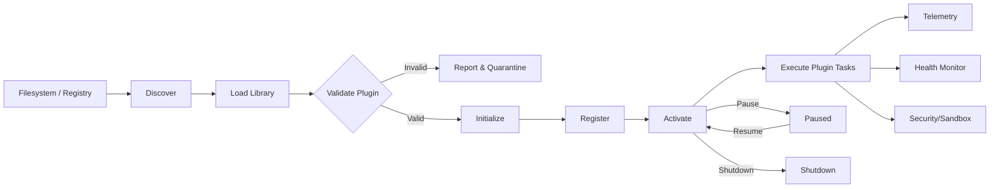

# Plugin Module: Tasks and Roadmap

This document outlines the planned tasks and roadmap for the Plugin module. Use this page to understand plugin flows, lifecycle, and upcoming work.

### At a Glance
- Plugin types: Survey, Processing Strategy, Output Format
- Capabilities: Discovery, Loading, Lifecycle, Registry, Security
- Lifecycle: Initialize → Activate → Pause/Resume → Shutdown
- Status: Phase 4 of Refactoring Plan (Plugin System)

### Plugin Flow

## Current Status

The Plugin module currently provides foundational interfaces and test specifications, with further implementation planned during Phase 4.

### Completed Tasks ✅
- Plugin interfaces and metadata structures
- Basic registry scaffolding
- Initial test specifications (see Test Specifications)

### In Progress Tasks 🔄
- Dynamic loader implementation
- Secure lifecycle management
- Health monitoring and telemetry hooks

## Roadmap

### Phase 4: Plugin Infrastructure (Weeks 1-3)
#### Task 4.1: Loader & Discovery
- Priority: High
- Effort: 4 days
- Deliverables: Dynamic loader with discovery and version checks

#### Task 4.2: Registry & Lifecycle
- Priority: High
- Effort: 3 days
- Deliverables: Robust registry, lifecycle manager, idempotent transitions

#### Task 4.3: Security & Isolation
- Priority: High
- Effort: 4 days
- Deliverables: Sandboxing guidelines, configuration guards, sanitization hooks

### Phase 5: Observability & Operations (Weeks 4-5)
#### Task 5.1: Telemetry Integration
- Priority: Medium
- Effort: 3 days
- Deliverables: Metrics, structured logs, error correlation

#### Task 5.2: Health & Recovery
- Priority: Medium
- Effort: 3 days
- Deliverables: Health checks, circuit breakers, retry policies

## Technical Debt
- Improve error reporting and recovery paths in loader
- Standardize plugin capability declarations
- Add compatibility matrix and policy enforcement

## Dependencies
- Internal: Config, Error Handling, Processing, Output modules
- External: Dynamic loading (e.g., libloading), OS capabilities

## Success Metrics
- Safe dynamic (un)loading without crashes
- Idempotent lifecycle transitions with 100% unit test pass
- Clear telemetry for plugin errors and performance

---

### Navigation
- [Docs Home](../../index.md)
- [Component Index](../index.md)
- [Component README](README.md)
- [Test Specifications](test_specifications.md)
