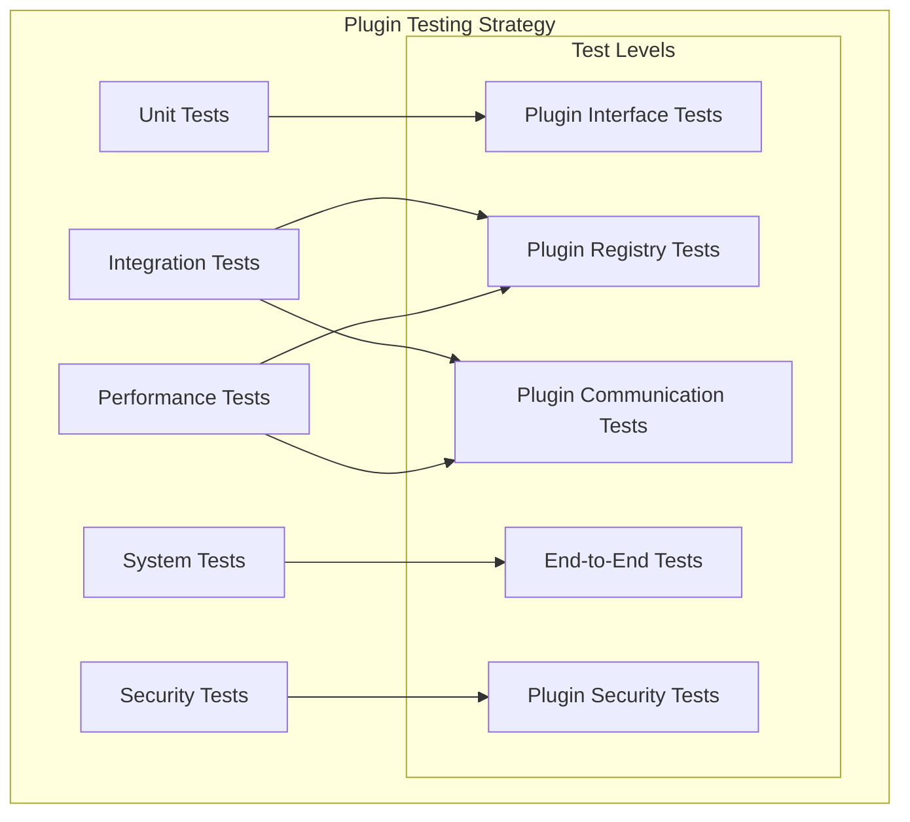

# Plugin Module: Test Specifications

This document provides comprehensive test specifications for the Plugin module in the Rusty BLS Data Processing system.

## Test Strategy Overview

The Plugin module testing strategy follows a multi-layered approach to ensure reliability, security, and performance:



## Unit Test Specifications

### Plugin Interface Tests

#### Test Suite: Plugin Trait Implementation
```rust
#[cfg(test)]
mod plugin_interface_tests {
    use super::*;
    use crate::plugin::{Plugin, PluginMetadata};
    use crate::test_utils::*;
    
    #[test]
    fn test_plugin_metadata_required_fields() {
        let plugin = create_test_plugin();
        let metadata = plugin.metadata();
        
        assert!(!metadata.name.is_empty(), "Plugin name must not be empty");
        assert!(!metadata.version.is_empty(), "Plugin version must not be empty");
        assert!(!metadata.description.is_empty(), "Plugin description must not be empty");
        assert!(!metadata.author.is_empty(), "Plugin author must not be empty");
    }
    
    #[test]
    fn test_plugin_initialization_idempotency() {
        let mut plugin = create_test_plugin();
        
        // First initialization should succeed
        assert!(plugin.initialize().is_ok());
        
        // Second initialization should be idempotent
        assert!(plugin.initialize().is_ok());
    }
    
    #[test]
    fn test_plugin_shutdown_idempotency() {
        let mut plugin = create_test_plugin();
        plugin.initialize().unwrap();
        
        // First shutdown should succeed
        assert!(plugin.shutdown().is_ok());
        
        // Second shutdown should be idempotent
        assert!(plugin.shutdown().is_ok());
    }
    
    #[test]
    fn test_plugin_lifecycle_state_transitions() {
        let mut plugin = create_managed_plugin();
        
        assert_eq!(plugin.state(), PluginState::Uninitialized);
        
        plugin.initialize().unwrap();
        assert_eq!(plugin.state(), PluginState::Active);
        
        plugin.pause().unwrap();
        assert_eq!(plugin.state(), PluginState::Paused);
        
        plugin.resume().unwrap();
        assert_eq!(plugin.state(), PluginState::Active);
        
        plugin.shutdown().unwrap();
        assert_eq!(plugin.state(), PluginState::Shutdown);
    }
}
```

#### Test Suite: Plugin Error Handling
```rust
#[cfg(test)]
mod plugin_error_tests {
    use super::*;
    
    #[test]
    fn test_plugin_initialization_failure() {
        let mut plugin = create_failing_plugin();
        
        let result = plugin.initialize();
        assert!(result.is_err());
        
        let error = result.unwrap_err();
        assert!(error.to_string().contains("initialization failed"));
    }
    
    #[test]
    fn test_plugin_error_context() {
        let plugin = create_test_plugin();
        let mut survey = create_invalid_survey();
        
        let result = plugin.process_survey(&mut survey);
        assert!(result.is_err());
        
        let error = result.unwrap_err();
        let error_chain = format!("{:?}", error);
        assert!(error_chain.contains("plugin"));
        assert!(error_chain.contains("survey"));
    }
    
    #[test]
    fn test_plugin_resource_exhaustion() {
        let plugin = create_resource_limited_plugin(1024); // 1KB limit
        let large_survey = create_large_survey(10000); // Large dataset
        
        let result = plugin.process_survey(&large_survey);
        assert!(result.is_err());
        
        match result.unwrap_err().downcast_ref::<PluginError>() {
            Some(PluginError::ResourceExhausted { .. }) => {},
            _ => panic!("Expected ResourceExhausted error"),
        }
    }
}
```

### Plugin Registry Tests

#### Test Suite: Plugin Registration
```rust
#[cfg(test)]
mod plugin_registry_tests {
    use super::*;
    
    #[test]
    fn test_plugin_registration_success() {
        let mut registry = PluginRegistry::new();
        let plugin = create_test_plugin();
        
        let result = registry.register(plugin);
        assert!(result.is_ok());
        assert_eq!(registry.plugin_count(), 1);
    }
    
    #[test]
    fn test_duplicate_plugin_registration() {
        let mut registry = PluginRegistry::new();
        let plugin1 = create_test_plugin_with_name("test_plugin");
        let plugin2 = create_test_plugin_with_name("test_plugin");
        
        assert!(registry.register(plugin1).is_ok());
        
        let result = registry.register(plugin2);
        assert!(result.is_err());
        
        match result.unwrap_err().downcast_ref::<PluginError>() {
            Some(PluginError::DuplicatePlugin { .. }) => {},
            _ => panic!("Expected DuplicatePlugin error"),
        }
    }
    
    #[test]
    fn test_plugin_dependency_resolution() {
        let mut registry = PluginRegistry::new();
        
        // Register plugins with dependencies
        let base_plugin = create_plugin_with_dependencies("base", vec![]);
        let dependent_plugin = create_plugin_with_dependencies("dependent", vec!["base".to_string()]);
        
        registry.register(base_plugin).unwrap();
        registry.register(dependent_plugin).unwrap();
        
        let initialization_order = registry.resolve_dependency_order().unwrap();
        assert_eq!(initialization_order, vec!["base", "dependent"]);
    }
    
    #[test]
    fn test_circular_dependency_detection() {
        let mut registry = PluginRegistry::new();
        
        let plugin_a = create_plugin_with_dependencies("plugin_a", vec!["plugin_b".to_string()]);
        let plugin_b = create_plugin_with_dependencies("plugin_b", vec!["plugin_a".to_string()]);
        
        registry.register(plugin_a).unwrap();
        
        let result = registry.register(plugin_b);
        assert!(result.is_err());
        
        match result.unwrap_err().downcast_ref::<PluginError>() {
            Some(PluginError::CircularDependency { .. }) => {},
            _ => panic!("Expected CircularDependency error"),
        }
    }
}
```

### Plugin Communication Tests

#### Test Suite: Message Bus
```rust
#[cfg(test)]
mod plugin_communication_tests {
    use super::*;
    
    #[test]
    fn test_message_bus_publish_subscribe() {
        let mut message_bus = MessageBus::new();
        let mut handler = TestMessageHandler::new();
        
        message_bus.subscribe("test_plugin", "data_processed".to_string()).unwrap();
        message_bus.register_handler("test_plugin", Box::new(handler)).unwrap();
        
        let message = PluginMessage {
            sender: "sender_plugin".to_string(),
            receiver: None,
            message_type: "data_processed".to_string(),
            payload: MessagePayload::DataProcessed {
                survey_code: "TEST".to_string(),
                record_count: 100,
            },
            timestamp: Instant::now(),
        };
        
        let result = message_bus.publish(message);
        assert!(result.is_ok());
        
        // Verify handler received message
        let handler = message_bus.get_handler("test_plugin").unwrap();
        assert_eq!(handler.message_count(), 1);
    }
    
    #[test]
    fn test_message_bus_targeted_delivery() {
        let mut message_bus = MessageBus::new();
        let handler1 = TestMessageHandler::new();
        let handler2 = TestMessageHandler::new();
        
        message_bus.register_handler("plugin1", Box::new(handler1)).unwrap();
        message_bus.register_handler("plugin2", Box::new(handler2)).unwrap();
        
        let message = PluginMessage {
            sender: "sender".to_string(),
            receiver: Some("plugin1".to_string()),
            message_type: "test_message".to_string(),
            payload: MessagePayload::Custom(serde_json::json!({"test": "data"})),
            timestamp: Instant::now(),
        };
        
        message_bus.publish(message).unwrap();
        
        // Only plugin1 should receive the message
        assert_eq!(message_bus.get_handler("plugin1").unwrap().message_count(), 1);
        assert_eq!(message_bus.get_handler("plugin2").unwrap().message_count(), 0);
    }
}
```

## Integration Test Specifications

### Plugin System Integration Tests

#### Test Suite: Plugin Loading and Execution
```rust
#[cfg(test)]
mod plugin_integration_tests {
    use super::*;
    
    #[test]
    fn test_plugin_loading_from_config() {
        let config_path = create_test_plugin_config();
        let mut plugin_manager = PluginManager::new();
        
        let result = plugin_manager.load_plugins_from_config(&config_path);
        assert!(result.is_ok());
        
        let loaded_plugins = plugin_manager.list_plugins();
        assert_eq!(loaded_plugins.len(), 3);
        assert!(loaded_plugins.contains(&"survey_plugin".to_string()));
        assert!(loaded_plugins.contains(&"processing_plugin".to_string()));
        assert!(loaded_plugins.contains(&"output_plugin".to_string()));
    }
    
    #[test]
    fn test_end_to_end_plugin_processing() {
        let mut system = create_test_system_with_plugins();
        let mut survey = create_test_survey("TEST");
        
        let result = system.process_survey(&mut survey);
        assert!(result.is_ok());
        
        // Verify each plugin processed the survey
        assert!(survey.metadata.contains_key("survey_plugin_processed"));
        assert!(survey.metadata.contains_key("processing_plugin_processed"));
        assert!(survey.metadata.contains_key("output_plugin_processed"));
    }
    
    #[test]
    fn test_plugin_failure_recovery() {
        let mut system = create_test_system_with_failing_plugin();
        let mut survey = create_test_survey("TEST");
        
        // Configure system to continue on plugin failure
        system.set_error_handling(ErrorHandlingStrategy::ContinueOnError);
        
        let result = system.process_survey(&mut survey);
        assert!(result.is_ok());
        
        // Verify other plugins still processed the survey
        assert!(survey.metadata.contains_key("working_plugin_processed"));
        assert!(!survey.metadata.contains_key("failing_plugin_processed"));
    }
}
```

#### Test Suite: Plugin Hot-Reload
```rust
#[cfg(test)]
mod plugin_hot_reload_tests {
    use super::*;
    use std::fs;
    use std::time::Duration;
    
    #[test]
    fn test_plugin_hot_reload_on_file_change() {
        let plugin_path = create_test_plugin_file();
        let mut hot_reloadable = HotReloadablePlugin::new(plugin_path.clone()).unwrap();
        
        // Initial load
        hot_reloadable.load().unwrap();
        let initial_version = hot_reloadable.plugin_version();
        
        // Simulate file change
        std::thread::sleep(Duration::from_millis(100));
        update_plugin_file(&plugin_path, "2.0.0");
        
        // Check for reload
        let reloaded = hot_reloadable.check_and_reload().unwrap();
        assert!(reloaded);
        
        let new_version = hot_reloadable.plugin_version();
        assert_ne!(initial_version, new_version);
    }
    
    #[test]
    fn test_plugin_state_preservation_during_reload() {
        let plugin_path = create_stateful_plugin_file();
        let mut hot_reloadable = HotReloadablePlugin::new(plugin_path.clone()).unwrap();
        
        hot_reloadable.load().unwrap();
        
        // Set some state
        hot_reloadable.set_plugin_state("test_key", "test_value").unwrap();
        
        // Trigger reload
        update_plugin_file(&plugin_path, "2.0.0");
        hot_reloadable.check_and_reload().unwrap();
        
        // Verify state is preserved
        let state_value = hot_reloadable.get_plugin_state("test_key").unwrap();
        assert_eq!(state_value, "test_value");
    }
}
```

## Performance Test Specifications

### Plugin Performance Tests

#### Test Suite: Plugin Loading Performance
```rust
#[cfg(test)]
mod plugin_performance_tests {
    use super::*;
    use std::time::Instant;
    
    #[test]
    fn test_plugin_loading_time() {
        let plugin_path = create_test_plugin_file();
        
        let start = Instant::now();
        let plugin = load_plugin_from_path(&plugin_path).unwrap();
        let loading_time = start.elapsed();
        
        // Plugin should load within 100ms
        assert!(loading_time < Duration::from_millis(100),
                "Plugin loading took {:?}, expected < 100ms", loading_time);
    }
    
    #[test]
    fn test_plugin_initialization_time() {
        let mut plugin = create_test_plugin();
        
        let start = Instant::now();
        plugin.initialize().unwrap();
        let init_time = start.elapsed();
        
        // Plugin should initialize within 50ms
        assert!(init_time < Duration::from_millis(50),
                "Plugin initialization took {:?}, expected < 50ms", init_time);
    }
    
    #[test]
    fn test_plugin_memory_usage() {
        let initial_memory = get_memory_usage();
        
        let plugin = create_test_plugin();
        let after_creation = get_memory_usage();
        
        let memory_overhead = after_creation - initial_memory;
        
        // Plugin should use less than 10MB of memory
        assert!(memory_overhead < 10 * 1024 * 1024,
                "Plugin memory overhead: {} bytes, expected < 10MB", memory_overhead);
    }
    
    #[test]
    fn test_plugin_processing_throughput() {
        let plugin = create_test_plugin();
        let surveys = create_test_surveys(1000);
        
        let start = Instant::now();
        for mut survey in surveys {
            plugin.process_survey(&mut survey).unwrap();
        }
        let processing_time = start.elapsed();
        
        let throughput = 1000.0 / processing_time.as_secs_f64();
        
        // Should process at least 100 surveys per second
        assert!(throughput >= 100.0,
                "Plugin throughput: {:.2} surveys/sec, expected >= 100", throughput);
    }
}
```

#### Test Suite: Plugin Communication Performance
```rust
#[cfg(test)]
mod plugin_communication_performance_tests {
    use super::*;
    
    #[test]
    fn test_message_bus_latency() {
        let mut message_bus = MessageBus::new();
        let handler = TestMessageHandler::new();
        
        message_bus.register_handler("test_plugin", Box::new(handler)).unwrap();
        message_bus.subscribe("test_plugin", "test_message".to_string()).unwrap();
        
        let message = create_test_message();
        
        let start = Instant::now();
        message_bus.publish(message).unwrap();
        let latency = start.elapsed();
        
        // Message delivery should take less than 1ms
        assert!(latency < Duration::from_millis(1),
                "Message latency: {:?}, expected < 1ms", latency);
    }
    
    #[test]
    fn test_message_bus_throughput() {
        let mut message_bus = MessageBus::new();
        let handler = TestMessageHandler::new();
        
        message_bus.register_handler("test_plugin", Box::new(handler)).unwrap();
        message_bus.subscribe("test_plugin", "test_message".to_string()).unwrap();
        
        let messages = create_test_messages(10000);
        
        let start = Instant::now();
        for message in messages {
            message_bus.publish(message).unwrap();
        }
        let processing_time = start.elapsed();
        
        let throughput = 10000.0 / processing_time.as_secs_f64();
        
        // Should handle at least 10,000 messages per second
        assert!(throughput >= 10000.0,
                "Message throughput: {:.2} msg/sec, expected >= 10,000", throughput);
    }
}
```

## Security Test Specifications

### Plugin Security Tests

#### Test Suite: Plugin Sandboxing
```rust
#[cfg(test)]
mod plugin_security_tests {
    use super::*;
    
    #[test]
    fn test_plugin_file_access_restrictions() {
        let plugin = create_sandboxed_plugin();
        let restricted_path = "/etc/passwd";
        
        let result = plugin.read_file(restricted_path);
        assert!(result.is_err());
        
        match result.unwrap_err().downcast_ref::<PluginError>() {
            Some(PluginError::AccessDenied { .. }) => {},
            _ => panic!("Expected AccessDenied error"),
        }
    }
    
    #[test]
    fn test_plugin_network_access_restrictions() {
        let plugin = create_network_restricted_plugin();
        
        let result = plugin.make_network_request("http://example.com");
        assert!(result.is_err());
        
        match result.unwrap_err().downcast_ref::<PluginError>() {
            Some(PluginError::NetworkAccessDenied { .. }) => {},
            _ => panic!("Expected NetworkAccessDenied error"),
        }
    }
    
    #[test]
    fn test_plugin_resource_limits() {
        let plugin = create_resource_limited_plugin(1024 * 1024); // 1MB limit
        
        // Try to allocate more memory than allowed
        let result = plugin.allocate_memory(2 * 1024 * 1024); // 2MB
        assert!(result.is_err());
        
        match result.unwrap_err().downcast_ref::<PluginError>() {
            Some(PluginError::ResourceLimitExceeded { .. }) => {},
            _ => panic!("Expected ResourceLimitExceeded error"),
        }
    }
    
    #[test]
    fn test_plugin_capability_enforcement() {
        let plugin = create_plugin_without_file_capability();
        
        let result = plugin.write_file("/tmp/test.txt", b"test data");
        assert!(result.is_err());
        
        match result.unwrap_err().downcast_ref::<PluginError>() {
            Some(PluginError::InsufficientCapabilities { .. }) => {},
            _ => panic!("Expected InsufficientCapabilities error"),
        }
    }
}
```

#### Test Suite: Plugin Input Validation
```rust
#[cfg(test)]
mod plugin_input_validation_tests {
    use super::*;
    
    #[test]
    fn test_plugin_input_sanitization() {
        let plugin = create_test_plugin();
        let malicious_survey = create_survey_with_malicious_data();
        
        let result = plugin.process_survey(&malicious_survey);
        
        // Plugin should either reject malicious input or sanitize it
        match result {
            Ok(processed_survey) => {
                // Verify data was sanitized
                assert!(!contains_malicious_patterns(&processed_survey));
            }
            Err(e) => {
                // Verify proper error for malicious input
                assert!(e.to_string().contains("invalid input"));
            }
        }
    }
    
    #[test]
    fn test_plugin_buffer_overflow_protection() {
        let plugin = create_test_plugin();
        let oversized_data = create_oversized_survey_data(1024 * 1024); // 1MB
        
        let result = plugin.process_survey_data(&oversized_data);
        
        // Should handle large input gracefully
        match result {
            Ok(_) => {}, // Processed successfully
            Err(e) => {
                // Or rejected with appropriate error
                assert!(e.to_string().contains("data too large"));
            }
        }
    }
}
```

## System Test Specifications

### End-to-End System Tests

#### Test Suite: Complete Plugin Workflow
```rust
#[cfg(test)]
mod plugin_system_tests {
    use super::*;
    
    #[test]
    fn test_complete_plugin_workflow() {
        // Setup complete system with all plugin types
        let mut system = RustySystem::new();
        system.load_plugins_from_directory("test_plugins/").unwrap();
        
        // Process a complete survey through the system
        let input_survey = load_test_survey("test_data/sample_survey.json");
        let result = system.process_survey(input_survey).unwrap();
        
        // Verify all processing stages completed
        assert!(result.metadata.contains_key("validation_completed"));
        assert!(result.metadata.contains_key("transformation_completed"));
        assert!(result.metadata.contains_key("output_generated"));
        
        // Verify output files were created
        assert!(std::path::Path::new("output/sample_survey.csv").exists());
        assert!(std::path::Path::new("output/sample_survey.parquet").exists());
    }
    
    #[test]
    fn test_plugin_system_resilience() {
        let mut system = RustySystem::new();
        system.load_plugins_from_directory("test_plugins/").unwrap();
        
        // Simulate plugin failure during processing
        system.inject_plugin_failure("transformation_plugin");
        
        let input_survey = load_test_survey("test_data/sample_survey.json");
        let result = system.process_survey(input_survey);
        
        // System should handle failure gracefully
        match result {
            Ok(processed_survey) => {
                // Verify fallback processing occurred
                assert!(processed_survey.metadata.contains_key("fallback_processing"));
            }
            Err(e) => {
                // Or provide clear error information
                assert!(e.to_string().contains("plugin failure"));
            }
        }
    }
}
```

## Test Data and Utilities

### Test Data Generation
```rust
pub mod test_utils {
    use super::*;
    
    pub fn create_test_plugin() -> Box<dyn Plugin> {
        Box::new(TestPlugin::new())
    }
    
    pub fn create_test_survey(code: &str) -> Survey {
        Survey {
            code: code.to_string(),
            name: format!("Test Survey {}", code),
            series: vec![
                create_test_series("SERIES001"),
                create_test_series("SERIES002"),
            ],
            metadata: HashMap::new(),
        }
    }
    
    pub fn create_test_series(id: &str) -> Series {
        Series {
            id: id.to_string(),
            title: format!("Test Series {}", id),
            observations: create_test_observations(100),
            attributes: HashMap::new(),
        }
    }
    
    pub fn create_test_observations(count: usize) -> Vec<Observation> {
        (0..count).map(|i| Observation {
            period: format!("2023-{:02}", (i % 12) + 1),
            value: Some((i as f64) * 1.5),
            flags: vec![],
        }).collect()
    }
    
    pub fn create_large_survey(series_count: usize) -> Survey {
        let mut survey = Survey {
            code: "LARGE".to_string(),
            name: "Large Test Survey".to_string(),
            series: Vec::with_capacity(series_count),
            metadata: HashMap::new(),
        };
        
        for i in 0..series_count {
            survey.series.push(create_test_series(&format!("SERIES{:06}", i)));
        }
        
        survey
    }
}
```

## Test Execution and Reporting

### Test Automation
```bash
#!/bin/bash
# Plugin test execution script

echo "Running Plugin Module Tests..."

# Unit tests
echo "Running unit tests..."
cargo test --lib plugin:: --verbose

# Integration tests
echo "Running integration tests..."
cargo test --test plugin_integration --verbose

# Performance tests
echo "Running performance tests..."
cargo test --test plugin_performance --verbose --release

# Security tests
echo "Running security tests..."
cargo test --test plugin_security --verbose

# Generate test coverage report
echo "Generating coverage report..."
cargo tarpaulin --out Html --output-dir target/coverage/plugin

echo "Plugin tests completed. See target/coverage/plugin/tarpaulin-report.html for coverage report."
```

### Test Metrics and Targets

#### Coverage Targets
- **Unit Test Coverage**: ≥ 95%
- **Integration Test Coverage**: ≥ 85%
- **Security Test Coverage**: ≥ 90%

#### Performance Targets
- **Plugin Loading Time**: < 100ms
- **Plugin Initialization Time**: < 50ms
- **Memory Overhead**: < 10MB per plugin
- **Message Latency**: < 1ms
- **Processing Throughput**: ≥ 100 surveys/second

#### Quality Targets
- **Test Pass Rate**: 100%
- **Security Vulnerabilities**: 0 critical, 0 high
- **Performance Regression**: 0%

This comprehensive test specification ensures the Plugin module meets all functional, performance, and security requirements while maintaining high code quality and reliability.