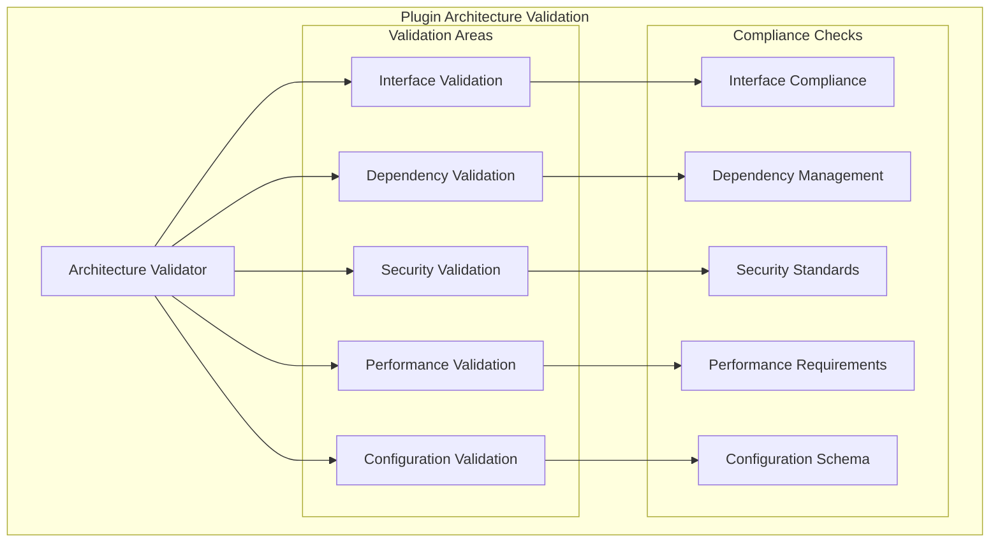

# Plugin Module: Architecture Validation

This document provides validation guidelines and compliance verification for the Plugin module against the Rusty BLS Data Processing system architecture.

## Architecture Compliance Overview

The Plugin module validation ensures adherence to the project's architectural principles and design patterns:



## Interface Validation

### Plugin Trait Compliance

#### Validation Rule: Plugin Interface Implementation
```rust
pub struct PluginInterfaceValidator;

impl PluginInterfaceValidator {
    pub fn validate_plugin_interface<P: Plugin>(plugin: &P) -> ValidationResult {
        let mut result = ValidationResult::new();
        
        // Validate metadata completeness
        let metadata = plugin.metadata();
        if metadata.name.is_empty() {
            result.add_error("Plugin name cannot be empty");
        }
        
        if metadata.version.is_empty() {
            result.add_error("Plugin version cannot be empty");
        }
        
        if !self.is_valid_semver(&metadata.version) {
            result.add_error("Plugin version must follow semantic versioning");
        }
        
        if metadata.description.is_empty() {
            result.add_error("Plugin description cannot be empty");
        }
        
        if metadata.author.is_empty() {
            result.add_error("Plugin author cannot be empty");
        }
        
        // Validate capabilities
        if metadata.capabilities.is_empty() {
            result.add_warning("Plugin should declare required capabilities");
        }
        
        for capability in &metadata.capabilities {
            if !self.is_valid_capability(capability) {
                result.add_error(&format!("Invalid capability: {}", capability));
            }
        }
        
        result
    }
    
    fn is_valid_semver(&self, version: &str) -> bool {
        // Validate semantic versioning format (x.y.z)
        let parts: Vec<&str> = version.split('.').collect();
        if parts.len() != 3 {
            return false;
        }
        
        parts.iter().all(|part| part.parse::<u32>().is_ok())
    }
    
    fn is_valid_capability(&self, capability: &str) -> bool {
        const VALID_CAPABILITIES: &[&str] = &[
            "file_read", "file_write", "network_access", "database_access",
            "system_info", "process_spawn", "environment_access"
        ];
        
        VALID_CAPABILITIES.contains(&capability)
    }
}
```

#### Validation Rule: Plugin Lifecycle Compliance
```rust
pub struct PluginLifecycleValidator;

impl PluginLifecycleValidator {
    pub fn validate_lifecycle_implementation<P: Plugin>(plugin: &mut P) -> ValidationResult {
        let mut result = ValidationResult::new();
        
        // Test initialization idempotency
        match plugin.initialize() {
            Ok(()) => {
                // Second initialization should also succeed
                if plugin.initialize().is_err() {
                    result.add_error("Plugin initialization is not idempotent");
                }
            }
            Err(e) => {
                result.add_error(&format!("Plugin initialization failed: {}", e));
            }
        }
        
        // Test shutdown idempotency
        match plugin.shutdown() {
            Ok(()) => {
                // Second shutdown should also succeed
                if plugin.shutdown().is_err() {
                    result.add_error("Plugin shutdown is not idempotent");
                }
            }
            Err(e) => {
                result.add_error(&format!("Plugin shutdown failed: {}", e));
            }
        }
        
        result
    }
}
```

### Survey Plugin Validation

#### Validation Rule: Survey Plugin Interface
```rust
pub struct SurveyPluginValidator;

impl SurveyPluginValidator {
    pub fn validate_survey_plugin<P: SurveyPlugin>(plugin: &P) -> ValidationResult {
        let mut result = ValidationResult::new();
        
        // Test survey support detection
        let test_surveys = vec!["AP", "BD", "CE", "INVALID"];
        let mut supported_count = 0;
        
        for survey_code in &test_surveys {
            if plugin.supports_survey(survey_code) {
                supported_count += 1;
            }
        }
        
        if supported_count == 0 {
            result.add_error("Plugin must support at least one survey type");
        }
        
        // Validate that plugin doesn't claim to support invalid surveys
        if plugin.supports_survey("INVALID") {
            result.add_warning("Plugin claims to support invalid survey code");
        }
        
        // Test processing with supported survey
        for survey_code in &test_surveys[..3] { // Skip "INVALID"
            if plugin.supports_survey(survey_code) {
                let mut test_survey = create_test_survey(survey_code);
                match plugin.process_survey(&mut test_survey) {
                    Ok(()) => {
                        result.add_info(&format!("Successfully processed survey: {}", survey_code));
                    }
                    Err(e) => {
                        result.add_error(&format!("Failed to process supported survey {}: {}", survey_code, e));
                    }
                }
                break;
            }
        }
        
        result
    }
}
```

## Dependency Validation

### Dependency Graph Validation

#### Validation Rule: Dependency Resolution
```rust
pub struct DependencyValidator;

impl DependencyValidator {
    pub fn validate_plugin_dependencies(registry: &PluginRegistry) -> ValidationResult {
        let mut result = ValidationResult::new();
        
        // Check for circular dependencies
        match self.detect_circular_dependencies(registry) {
            Ok(()) => {
                result.add_info("No circular dependencies detected");
            }
            Err(cycles) => {
                for cycle in cycles {
                    result.add_error(&format!("Circular dependency detected: {}", cycle.join(" -> ")));
                }
            }
        }
        
        // Validate dependency versions
        for plugin_name in registry.list_plugins() {
            if let Some(metadata) = registry.get_plugin_metadata(plugin_name) {
                for dependency in &metadata.dependencies {
                    match self.validate_dependency_version(registry, dependency) {
                        Ok(()) => {},
                        Err(e) => {
                            result.add_error(&format!("Dependency validation failed for {}: {}", plugin_name, e));
                        }
                    }
                }
            }
        }
        
        // Check initialization order
        match registry.resolve_dependency_order() {
            Ok(order) => {
                result.add_info(&format!("Plugin initialization order: {}", order.join(" -> ")));
            }
            Err(e) => {
                result.add_error(&format!("Failed to resolve dependency order: {}", e));
            }
        }
        
        result
    }
    
    fn detect_circular_dependencies(&self, registry: &PluginRegistry) -> Result<(), Vec<Vec<String>>> {
        let mut cycles = Vec::new();
        let mut visited = HashSet::new();
        let mut rec_stack = HashSet::new();
        
        for plugin_name in registry.list_plugins() {
            if !visited.contains(plugin_name) {
                if let Some(cycle) = self.dfs_cycle_detection(
                    registry, plugin_name, &mut visited, &mut rec_stack
                ) {
                    cycles.push(cycle);
                }
            }
        }
        
        if cycles.is_empty() {
            Ok(())
        } else {
            Err(cycles)
        }
    }
}
```

### Version Compatibility Validation

#### Validation Rule: Version Compatibility
```rust
pub struct VersionCompatibilityValidator;

impl VersionCompatibilityValidator {
    pub fn validate_version_compatibility(
        plugin_version: &str,
        required_version: &str
    ) -> ValidationResult {
        let mut result = ValidationResult::new();
        
        match self.parse_version_requirement(required_version) {
            Ok(requirement) => {
                match self.check_version_compatibility(plugin_version, &requirement) {
                    Ok(true) => {
                        result.add_info(&format!(
                            "Version {} satisfies requirement {}",
                            plugin_version, required_version
                        ));
                    }
                    Ok(false) => {
                        result.add_error(&format!(
                            "Version {} does not satisfy requirement {}",
                            plugin_version, required_version
                        ));
                    }
                    Err(e) => {
                        result.add_error(&format!("Version compatibility check failed: {}", e));
                    }
                }
            }
            Err(e) => {
                result.add_error(&format!("Invalid version requirement {}: {}", required_version, e));
            }
        }
        
        result
    }
    
    fn parse_version_requirement(&self, requirement: &str) -> Result<VersionRequirement, String> {
        // Parse version requirements like ">=1.0.0", "~1.2.0", "^2.0.0"
        if requirement.starts_with(">=") {
            let version = &requirement[2..];
            Ok(VersionRequirement::GreaterOrEqual(version.to_string()))
        } else if requirement.starts_with("~") {
            let version = &requirement[1..];
            Ok(VersionRequirement::Compatible(version.to_string()))
        } else if requirement.starts_with("^") {
            let version = &requirement[1..];
            Ok(VersionRequirement::CaretCompatible(version.to_string()))
        } else {
            Ok(VersionRequirement::Exact(requirement.to_string()))
        }
    }
}

#[derive(Debug, Clone)]
enum VersionRequirement {
    Exact(String),
    GreaterOrEqual(String),
    Compatible(String),
    CaretCompatible(String),
}
```

## Security Validation

### Security Compliance Validation

#### Validation Rule: Security Standards
```rust
pub struct SecurityValidator;

impl SecurityValidator {
    pub fn validate_plugin_security<P: Plugin>(plugin: &P) -> ValidationResult {
        let mut result = ValidationResult::new();
        
        let metadata = plugin.metadata();
        
        // Validate capability declarations
        if metadata.capabilities.is_empty() {
            result.add_warning("Plugin should declare required capabilities for security");
        }
        
        // Check for dangerous capabilities
        let dangerous_capabilities = vec!["system_admin", "unrestricted_access", "root_access"];
        for capability in &metadata.capabilities {
            if dangerous_capabilities.contains(&capability.as_str()) {
                result.add_error(&format!("Plugin requests dangerous capability: {}", capability));
            }
        }
        
        // Validate plugin signature (if available)
        if let Some(signature) = &metadata.signature {
            match self.verify_plugin_signature(plugin, signature) {
                Ok(true) => {
                    result.add_info("Plugin signature verified successfully");
                }
                Ok(false) => {
                    result.add_error("Plugin signature verification failed");
                }
                Err(e) => {
                    result.add_error(&format!("Plugin signature verification error: {}", e));
                }
            }
        } else {
            result.add_warning("Plugin is not digitally signed");
        }
        
        // Check for security best practices
        self.validate_security_best_practices(plugin, &mut result);
        
        result
    }
    
    fn validate_security_best_practices<P: Plugin>(&self, plugin: &P, result: &mut ValidationResult) {
        // Check if plugin implements input validation
        if !self.has_input_validation(plugin) {
            result.add_warning("Plugin should implement input validation");
        }
        
        // Check if plugin handles errors securely
        if !self.has_secure_error_handling(plugin) {
            result.add_warning("Plugin should implement secure error handling");
        }
        
        // Check for resource limits
        if !self.has_resource_limits(plugin) {
            result.add_warning("Plugin should implement resource limits");
        }
    }
}
```

### Sandboxing Validation

#### Validation Rule: Sandbox Compliance
```rust
pub struct SandboxValidator;

impl SandboxValidator {
    pub fn validate_sandbox_compliance(plugin_wrapper: &SecurePluginWrapper) -> ValidationResult {
        let mut result = ValidationResult::new();
        
        // Test file system restrictions
        match self.test_file_system_restrictions(plugin_wrapper) {
            Ok(()) => {
                result.add_info("File system restrictions working correctly");
            }
            Err(e) => {
                result.add_error(&format!("File system restriction test failed: {}", e));
            }
        }
        
        // Test network restrictions
        match self.test_network_restrictions(plugin_wrapper) {
            Ok(()) => {
                result.add_info("Network restrictions working correctly");
            }
            Err(e) => {
                result.add_error(&format!("Network restriction test failed: {}", e));
            }
        }
        
        // Test resource limits
        match self.test_resource_limits(plugin_wrapper) {
            Ok(()) => {
                result.add_info("Resource limits working correctly");
            }
            Err(e) => {
                result.add_error(&format!("Resource limit test failed: {}", e));
            }
        }
        
        result
    }
    
    fn test_file_system_restrictions(&self, wrapper: &SecurePluginWrapper) -> Result<(), String> {
        // Test that plugin cannot access restricted paths
        let restricted_paths = vec!["/etc/passwd", "/root", "/sys"];
        
        for path in restricted_paths {
            match wrapper.execute_with_security(|| {
                std::fs::read(path)
            }) {
                Ok(_) => {
                    return Err(format!("Plugin was able to access restricted path: {}", path));
                }
                Err(_) => {
                    // Expected - access should be denied
                }
            }
        }
        
        Ok(())
    }
}
```

## Performance Validation

### Performance Requirements Validation

#### Validation Rule: Performance Standards
```rust
pub struct PerformanceValidator;

impl PerformanceValidator {
    pub fn validate_plugin_performance<P: Plugin>(plugin: &mut P) -> ValidationResult {
        let mut result = ValidationResult::new();
        
        // Test initialization time
        let start = Instant::now();
        match plugin.initialize() {
            Ok(()) => {
                let init_time = start.elapsed();
                if init_time > Duration::from_millis(100) {
                    result.add_warning(&format!(
                        "Plugin initialization took {:?}, expected < 100ms",
                        init_time
                    ));
                } else {
                    result.add_info(&format!("Plugin initialization time: {:?}", init_time));
                }
            }
            Err(e) => {
                result.add_error(&format!("Plugin initialization failed: {}", e));
            }
        }
        
        // Test memory usage
        let initial_memory = self.get_memory_usage();
        let _plugin_ref = plugin; // Keep plugin in scope
        let memory_after_creation = self.get_memory_usage();
        let memory_overhead = memory_after_creation - initial_memory;
        
        if memory_overhead > 10 * 1024 * 1024 { // 10MB
            result.add_warning(&format!(
                "Plugin memory overhead: {} bytes, expected < 10MB",
                memory_overhead
            ));
        } else {
            result.add_info(&format!("Plugin memory overhead: {} bytes", memory_overhead));
        }
        
        result
    }
    
    fn get_memory_usage(&self) -> usize {
        // Platform-specific memory usage measurement
        #[cfg(target_os = "linux")]
        {
            self.get_linux_memory_usage()
        }
        #[cfg(not(target_os = "linux"))]
        {
            0 // Fallback for other platforms
        }
    }
}
```

### Throughput Validation

#### Validation Rule: Processing Throughput
```rust
pub struct ThroughputValidator;

impl ThroughputValidator {
    pub fn validate_processing_throughput<P: SurveyPlugin>(plugin: &P) -> ValidationResult {
        let mut result = ValidationResult::new();
        
        // Create test data
        let test_surveys = self.create_test_surveys(100);
        
        // Measure processing time
        let start = Instant::now();
        let mut processed_count = 0;
        
        for mut survey in test_surveys {
            if plugin.supports_survey(&survey.code) {
                match plugin.process_survey(&mut survey) {
                    Ok(()) => processed_count += 1,
                    Err(e) => {
                        result.add_warning(&format!("Failed to process survey: {}", e));
                    }
                }
            }
        }
        
        let processing_time = start.elapsed();
        
        if processed_count > 0 {
            let throughput = processed_count as f64 / processing_time.as_secs_f64();
            
            if throughput < 10.0 { // Minimum 10 surveys per second
                result.add_warning(&format!(
                    "Plugin throughput: {:.2} surveys/sec, expected >= 10",
                    throughput
                ));
            } else {
                result.add_info(&format!("Plugin throughput: {:.2} surveys/sec", throughput));
            }
        } else {
            result.add_warning("Plugin did not process any test surveys");
        }
        
        result
    }
}
```

## Configuration Validation

### Configuration Schema Validation

#### Validation Rule: Configuration Compliance
```rust
pub struct ConfigurationValidator;

impl ConfigurationValidator {
    pub fn validate_plugin_configuration(config: &PluginConfig) -> ValidationResult {
        let mut result = ValidationResult::new();
        
        // Validate required fields
        if config.name.is_empty() {
            result.add_error("Plugin configuration must have a name");
        }
        
        if config.version.is_empty() {
            result.add_error("Plugin configuration must have a version");
        }
        
        // Validate version format
        if !self.is_valid_semver(&config.version) {
            result.add_error("Plugin version must follow semantic versioning (x.y.z)");
        }
        
        // Validate plugin path
        if let Some(path) = &config.path {
            if !std::path::Path::new(path).exists() {
                result.add_error(&format!("Plugin path does not exist: {}", path));
            }
        }
        
        // Validate dependencies
        for dependency in &config.dependencies {
            if dependency.is_empty() {
                result.add_error("Plugin dependency name cannot be empty");
            }
        }
        
        // Validate capabilities
        for capability in &config.capabilities {
            if !self.is_valid_capability(capability) {
                result.add_error(&format!("Invalid capability: {}", capability));
            }
        }
        
        // Validate configuration parameters
        self.validate_configuration_parameters(&config.parameters, &mut result);
        
        result
    }
    
    fn validate_configuration_parameters(
        &self,
        parameters: &HashMap<String, serde_json::Value>,
        result: &mut ValidationResult
    ) {
        for (key, value) in parameters {
            // Validate parameter names
            if key.is_empty() {
                result.add_error("Configuration parameter name cannot be empty");
            }
            
            // Validate parameter values based on type
            match value {
                serde_json::Value::String(s) if s.is_empty() => {
                    result.add_warning(&format!("Configuration parameter '{}' has empty string value", key));
                }
                serde_json::Value::Number(n) if !n.is_finite() => {
                    result.add_error(&format!("Configuration parameter '{}' has invalid number value", key));
                }
                _ => {} // Other types are generally valid
            }
        }
    }
}
```

## Integration Validation

### System Integration Validation

#### Validation Rule: Component Integration
```rust
pub struct IntegrationValidator;

impl IntegrationValidator {
    pub fn validate_system_integration(system: &RustySystem) -> ValidationResult {
        let mut result = ValidationResult::new();
        
        // Validate plugin manager integration
        match self.validate_plugin_manager_integration(system) {
            Ok(()) => {
                result.add_info("Plugin manager integration validated");
            }
            Err(e) => {
                result.add_error(&format!("Plugin manager integration failed: {}", e));
            }
        }
        
        // Validate configuration system integration
        match self.validate_configuration_integration(system) {
            Ok(()) => {
                result.add_info("Configuration system integration validated");
            }
            Err(e) => {
                result.add_error(&format!("Configuration integration failed: {}", e));
            }
        }
        
        // Validate error system integration
        match self.validate_error_system_integration(system) {
            Ok(()) => {
                result.add_info("Error system integration validated");
            }
            Err(e) => {
                result.add_error(&format!("Error system integration failed: {}", e));
            }
        }
        
        result
    }
    
    fn validate_plugin_manager_integration(&self, system: &RustySystem) -> Result<(), String> {
        // Test that plugin manager can load plugins
        let plugin_count_before = system.plugin_manager().plugin_count();
        
        // Try to load a test plugin
        let test_plugin = create_test_plugin();
        system.plugin_manager().register_plugin(test_plugin)
            .map_err(|e| format!("Failed to register test plugin: {}", e))?;
        
        let plugin_count_after = system.plugin_manager().plugin_count();
        
        if plugin_count_after != plugin_count_before + 1 {
            return Err("Plugin registration did not increase plugin count".to_string());
        }
        
        Ok(())
    }
}
```

## Validation Reporting

### Validation Result Aggregation

#### Validation Report Generation
```rust
pub struct ValidationReport {
    pub component: String,
    pub timestamp: chrono::DateTime<chrono::Utc>,
    pub results: Vec<ValidationResult>,
    pub summary: ValidationSummary,
}

#[derive(Debug, Clone)]
pub struct ValidationSummary {
    pub total_checks: usize,
    pub passed_checks: usize,
    pub failed_checks: usize,
    pub warnings: usize,
    pub errors: usize,
    pub overall_status: ValidationStatus,
}

#[derive(Debug, Clone, PartialEq)]
pub enum ValidationStatus {
    Passed,
    PassedWithWarnings,
    Failed,
}

impl ValidationReport {
    pub fn generate_for_plugin<P: Plugin>(plugin: &mut P) -> Self {
        let mut results = Vec::new();
        
        // Run all validation checks
        results.push(PluginInterfaceValidator::validate_plugin_interface(plugin));
        results.push(PluginLifecycleValidator::validate_lifecycle_implementation(plugin));
        results.push(SecurityValidator::validate_plugin_security(plugin));
        results.push(PerformanceValidator::validate_plugin_performance(plugin));
        
        let summary = Self::calculate_summary(&results);
        
        Self {
            component: plugin.metadata().name.clone(),
            timestamp: chrono::Utc::now(),
            results,
            summary,
        }
    }
    
    fn calculate_summary(results: &[ValidationResult]) -> ValidationSummary {
        let mut total_checks = 0;
        let mut passed_checks = 0;
        let mut failed_checks = 0;
        let mut warnings = 0;
        let mut errors = 0;
        
        for result in results {
            total_checks += 1;
            
            if result.has_errors() {
                failed_checks += 1;
                errors += result.error_count();
            } else {
                passed_checks += 1;
            }
            
            warnings += result.warning_count();
        }
        
        let overall_status = if errors > 0 {
            ValidationStatus::Failed
        } else if warnings > 0 {
            ValidationStatus::PassedWithWarnings
        } else {
            ValidationStatus::Passed
        };
        
        ValidationSummary {
            total_checks,
            passed_checks,
            failed_checks,
            warnings,
            errors,
            overall_status,
        }
    }
    
    pub fn to_json(&self) -> serde_json::Value {
        serde_json::json!({
            "component": self.component,
            "timestamp": self.timestamp.to_rfc3339(),
            "summary": {
                "total_checks": self.summary.total_checks,
                "passed_checks": self.summary.passed_checks,
                "failed_checks": self.summary.failed_checks,
                "warnings": self.summary.warnings,
                "errors": self.summary.errors,
                "overall_status": format!("{:?}", self.summary.overall_status)
            },
            "results": self.results.iter().map(|r| r.to_json()).collect::<Vec<_>>()
        })
    }
}
```

## Continuous Validation

### Automated Validation Pipeline

#### Validation Automation
```bash
#!/bin/bash
# Plugin validation automation script

echo "Running Plugin Module Validation..."

# Create validation report directory
mkdir -p target/validation/plugin

# Run interface validation
echo "Validating plugin interfaces..."
cargo test --lib plugin::validation::interface --verbose > target/validation/plugin/interface.log 2>&1

# Run dependency validation
echo "Validating plugin dependencies..."
cargo test --lib plugin::validation::dependency --verbose > target/validation/plugin/dependency.log 2>&1

# Run security validation
echo "Validating plugin security..."
cargo test --lib plugin::validation::security --verbose > target/validation/plugin/security.log 2>&1

# Run performance validation
echo "Validating plugin performance..."
cargo test --lib plugin::validation::performance --verbose --release > target/validation/plugin/performance.log 2>&1

# Run integration validation
echo "Validating system integration..."
cargo test --test plugin_integration_validation --verbose > target/validation/plugin/integration.log 2>&1

# Generate validation report
echo "Generating validation report..."
cargo run --bin plugin_validator -- --output target/validation/plugin/report.json

echo "Plugin validation completed. See target/validation/plugin/ for detailed reports."
```

This comprehensive validation framework ensures that the Plugin module maintains architectural compliance, security standards, and performance requirements throughout its development and deployment lifecycle.