# Processing System Documentation

Welcome to the Processing System documentation for the Rusty BLS Data Processing system. This component handles all data processing strategies, pipeline management, and transformation operations.

## Overview

The Processing System is responsible for:
- Implementing multiple processing strategies for different data sizes
- Managing the data processing pipeline with configurable stages
- Coordinating data transformations and validations
- Optimizing performance based on data characteristics
- Providing parallel and concurrent processing capabilities

## Architecture

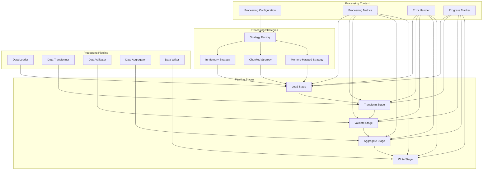

## Processing Strategy Selection

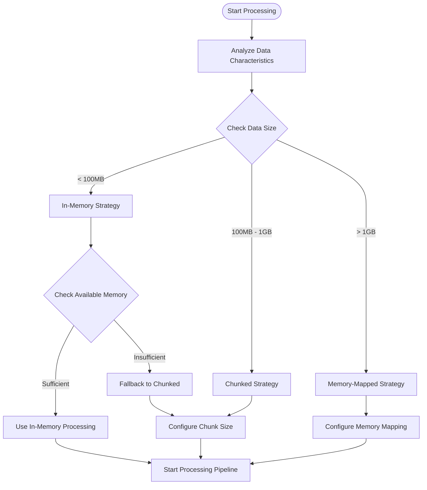

## Processing Pipeline Flow

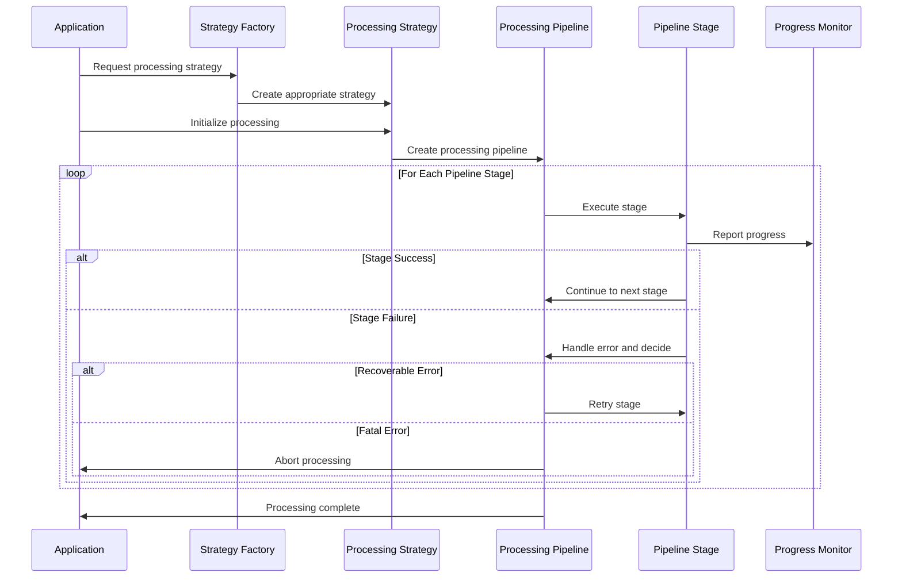

## Processing Strategies

### In-Memory Strategy

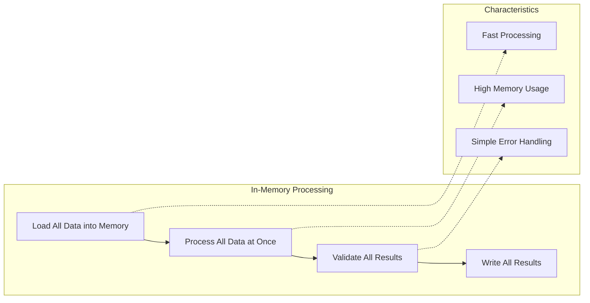

### Chunked Strategy

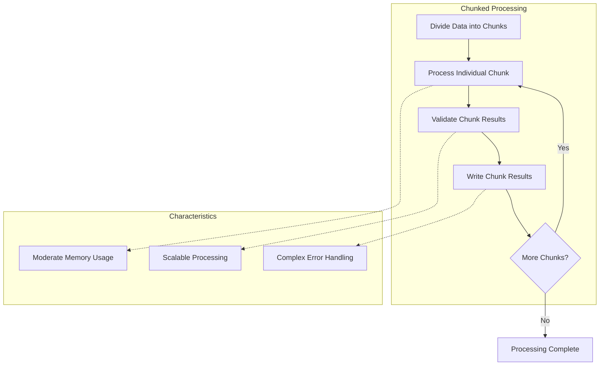

### Memory-Mapped Strategy

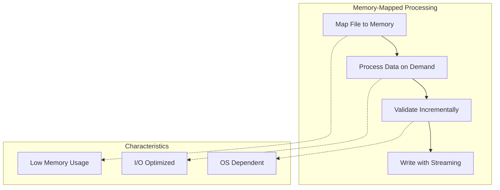

## Pipeline Stage Architecture

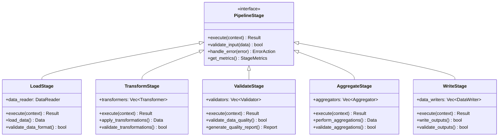

## Data Transformation Pipeline

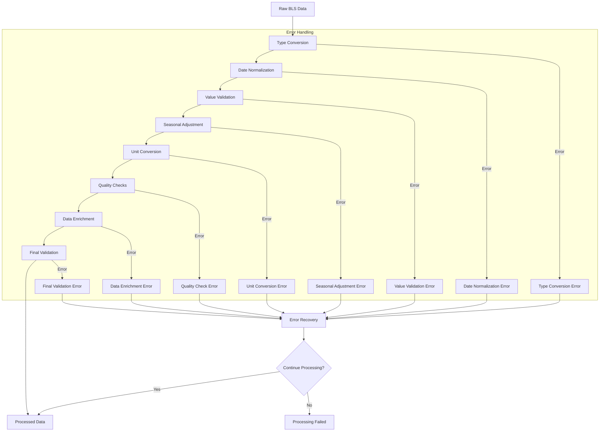

## Parallel Processing Architecture

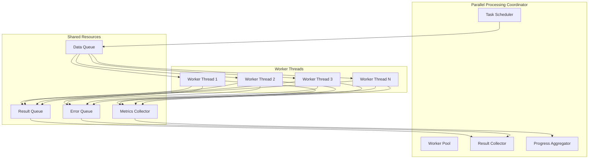

## Performance Optimization Strategies

### Memory Optimization

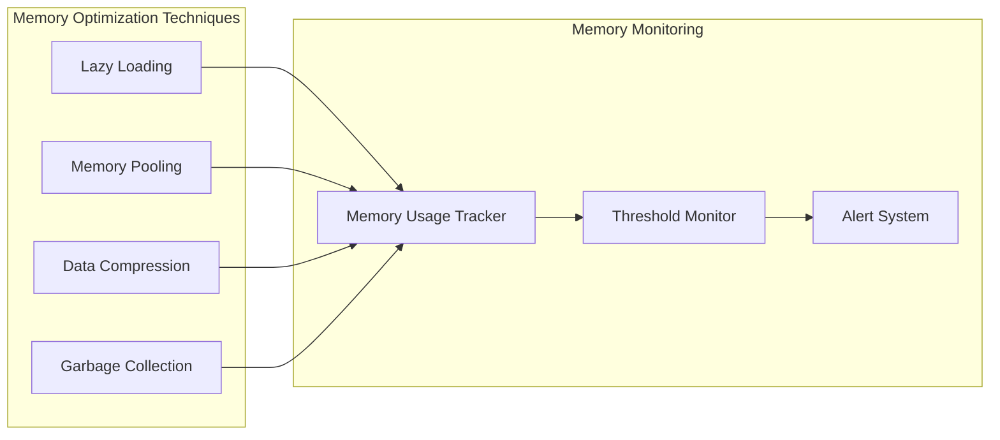

### CPU Optimization

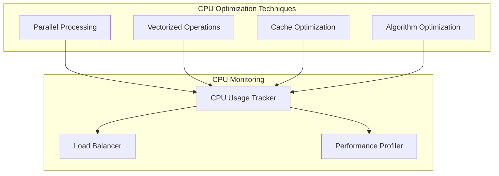

## Error Handling and Recovery

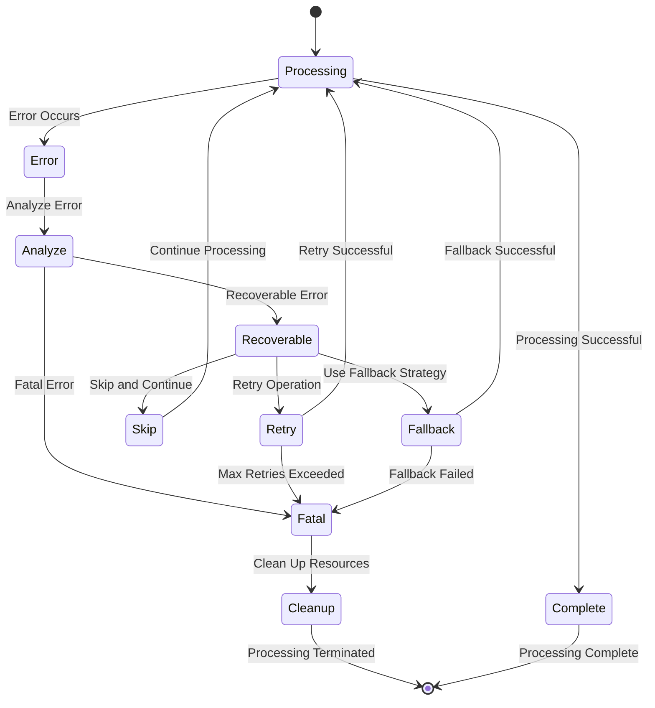

## Key Features

### 🚀 Multiple Processing Strategies
- **In-Memory**: Fast processing for small datasets
- **Chunked**: Balanced approach for medium datasets
- **Memory-Mapped**: Efficient processing for large datasets
- **Automatic Selection**: Strategy selection based on data characteristics

### 🔄 Configurable Pipeline
- **Modular Stages**: Independent, reusable processing stages
- **Custom Transformations**: Support for survey-specific transformations
- **Parallel Execution**: Concurrent processing of independent operations
- **Error Recovery**: Robust error handling and recovery mechanisms

### 📊 Performance Monitoring
- **Real-time Metrics**: Live performance monitoring and reporting
- **Resource Tracking**: Memory, CPU, and I/O usage monitoring
- **Progress Reporting**: Detailed progress tracking and estimation
- **Performance Profiling**: Bottleneck identification and optimization

### 🛡️ Quality Assurance
- **Data Validation**: Comprehensive data quality checks
- **Consistency Verification**: Cross-validation of processed data
- **Quality Metrics**: Detailed quality reporting and scoring
- **Audit Trail**: Complete processing history and lineage

## Integration with Other Components

### Configuration Integration
The Processing System receives configuration from the Configuration System:
- Processing strategy preferences and thresholds
- Pipeline stage configuration and parameters
- Performance tuning settings
- Error handling policies and recovery strategies

### Data Layer Integration
The Processing System works closely with the Data Layer:
- Receives structured data models for processing
- Applies transformations and validations
- Provides processed data for output generation
- Reports data quality metrics and issues

### Error Handling Integration
The Processing System integrates with the Error Handling System:
- Reports processing errors with detailed context
- Implements error recovery strategies
- Provides error metrics and analytics
- Supports error notification and alerting

## Performance Considerations

### Memory Management
- Monitor memory usage throughout processing
- Use appropriate strategy based on available memory
- Implement memory pooling for frequently allocated objects
- Clean up resources promptly to avoid memory leaks

### CPU Utilization
- Leverage parallel processing for independent operations
- Use vectorized operations where possible
- Optimize algorithms for cache efficiency
- Balance CPU usage across available cores

### I/O Optimization
- Minimize disk I/O through efficient data structures
- Use memory mapping for large files
- Implement buffered I/O for sequential access
- Optimize file access patterns

## Testing Strategy

### Unit Tests
- Test individual processing stages in isolation
- Test strategy selection logic
- Test error handling and recovery mechanisms
- Test performance optimization features

### Integration Tests
- Test complete processing pipelines
- Test with real BLS survey data
- Test performance under various load conditions
- Test error scenarios and recovery

### Performance Tests
- Benchmark processing strategies with different data sizes
- Test memory usage and optimization
- Test parallel processing scalability
- Validate performance optimization strategies

## Best Practices

### Strategy Selection
- Choose strategies based on data characteristics
- Consider available system resources
- Monitor performance and adjust as needed
- Test strategies with representative data

### Pipeline Design
- Keep stages independent and reusable
- Implement comprehensive error handling
- Use appropriate parallelization strategies
- Monitor and optimize performance bottlenecks

### Error Handling
- Implement graceful error recovery
- Provide detailed error context and reporting
- Use appropriate retry and fallback strategies
- Monitor error rates and patterns

### Performance Optimization
- Profile processing performance regularly
- Optimize critical processing paths
- Use appropriate data structures and algorithms
- Monitor resource usage and optimize accordingly

## Troubleshooting

### Common Issues

1. **Memory Issues**
   - Switch to chunked or memory-mapped strategy
   - Reduce chunk sizes for chunked processing
   - Monitor memory usage and optimize allocations

2. **Performance Issues**
   - Profile processing bottlenecks
   - Optimize parallel processing configuration
   - Check I/O patterns and optimize access
   - Review algorithm efficiency

3. **Error Handling Issues**
   - Review error handling configuration
   - Check error recovery strategies
   - Monitor error rates and patterns
   - Validate data quality and consistency

## Contributing

When contributing to the Processing System:

1. Follow the existing pipeline stage patterns
2. Implement comprehensive error handling
3. Add performance monitoring and metrics
4. Write tests for all processing logic
5. Document processing algorithms and optimizations

## Further Reading

- [Processing Strategy Guide](strategies.md)
- [Pipeline Configuration Reference](pipeline.md)
- [Performance Optimization Guide](performance.md)
- [Error Handling Best Practices](error_handling.md)

---

For questions about the Processing System, please refer to the troubleshooting section or create an issue in the project repository.