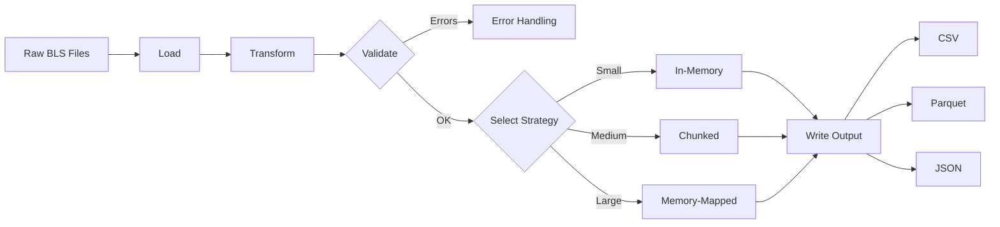
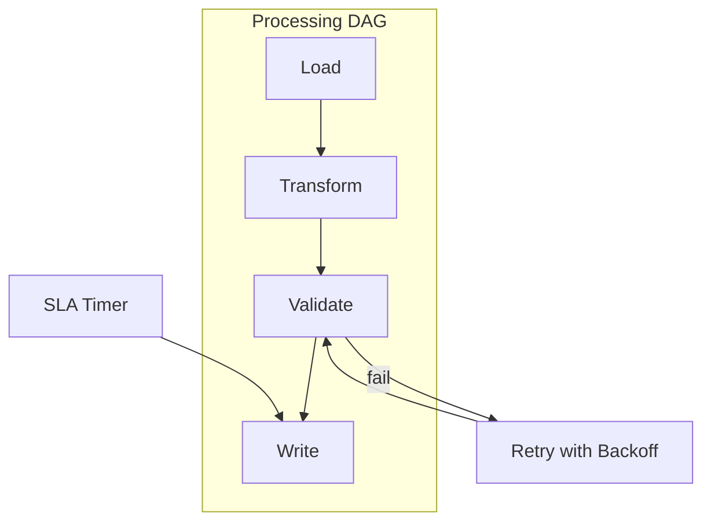

# Processing Module: Tasks and Roadmap

This document outlines the planned tasks and roadmap for the Processing module. Use this page to understand the processing flows and what's next.

### At a Glance
- Strategies: In-memory, Chunked, Memory-mapped
- Pipeline stages: Load → Transform → Validate → Write
- Parallelism: Thread/chunk-based execution
- Status: Core Implementation phase

### Processing Flow

### DAG Execution (Conceptual)

## Current Status

The Processing module is currently in the **Core Implementation** phase.

### Completed Tasks ✅
- Basic processing strategy interfaces
- In-memory processing strategy implementation
- Processing pipeline framework
- Strategy factory pattern

### In Progress Tasks 🔄
- Chunked processing strategy optimization
- Memory-mapped processing strategy
- Parallel processing capabilities
- Advanced pipeline stage implementations

## Roadmap

### Phase 1: Strategy Enhancement (Weeks 1-2)
#### Task 1.1: Chunked Processing Strategy
- **Priority**: High
- **Effort**: 4 days
- **Deliverables**: Optimized chunked processing with configurable chunk sizes

#### Task 1.2: Memory-Mapped Processing Strategy
- **Priority**: High
- **Effort**: 5 days
- **Deliverables**: MmapStrategy implementation for large datasets

### Phase 2: Pipeline Development (Weeks 3-4)
#### Task 2.1: Advanced Pipeline Stages
- **Priority**: High
- **Effort**: 6 days
- **Deliverables**: Enhanced loader, transformer, validator, and writer stages

#### Task 2.2: Pipeline Builder Pattern
- **Priority**: Medium
- **Effort**: 3 days
- **Deliverables**: Flexible pipeline construction with builder pattern

### Phase 3: Performance Optimization (Weeks 5-6)
#### Task 3.1: Parallel Processing
- **Priority**: High
- **Effort**: 5 days
- **Deliverables**: Multi-threaded processing capabilities

#### Task 3.2: Memory Optimization
- **Priority**: High
- **Effort**: 4 days
- **Deliverables**: Memory-efficient processing for large datasets

### Phase 4: Advanced Features (Weeks 7-8)
#### Task 4.1: Stream Processing
- **Priority**: Medium
- **Effort**: 4 days
- **Deliverables**: Streaming data processing capabilities

#### Task 4.2: Processing Metrics
- **Priority**: Medium
- **Effort**: 3 days
- **Deliverables**: Performance monitoring and metrics collection

## Technical Debt
- **Error Handling**: Improve error context and recovery mechanisms
- **Memory Management**: Optimize memory usage patterns
- **Documentation**: Add comprehensive inline documentation

## Dependencies
- **Internal**: Data, Configuration, Error handling modules
- **External**: `rayon`, `crossbeam`, `tokio`, `memmap2`

## Success Metrics
- **Performance**: Process 1M records/second for in-memory strategy
- **Memory**: Memory usage < 2GB for 10GB datasets with chunked strategy
- **Scalability**: Linear performance scaling with thread count
- **Quality**: Test coverage > 95%

## Risk Assessment
- **Memory Pressure**: Large datasets may cause memory issues
- **Performance Bottlenecks**: I/O operations may limit processing speed
- **Complexity**: Pipeline configuration may become too complex

## Mitigation Strategies
- Implement comprehensive memory monitoring
- Use streaming and chunked processing for large datasets
- Provide simple configuration templates and presets

---

### Navigation
- [Docs Home](../../README.md)
- [Component Index](index.md)
- [Component README](README.md)
- [Test Specifications](test_specifications.md)
