# Utilities Documentation

Welcome to the Utilities documentation for the Rusty BLS Data Processing system. This component provides essential utility functions and helpers used throughout the system.

## Overview

The Utilities component provides:
- Path manipulation and file system operations
- File handling utilities with safety checks
- Time and date processing functions
- Data formatting and conversion utilities
- Validation helpers and common patterns
- System resource monitoring utilities

## Architecture

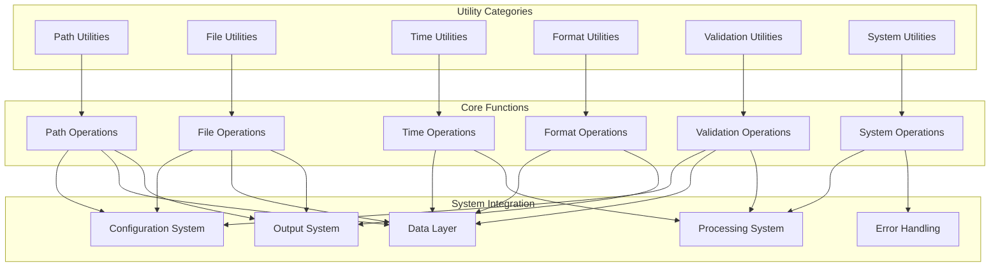

## Utility Components

### Path Utilities

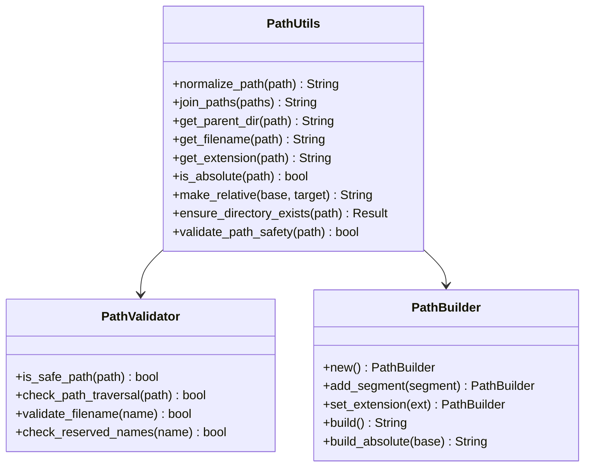

### File Utilities

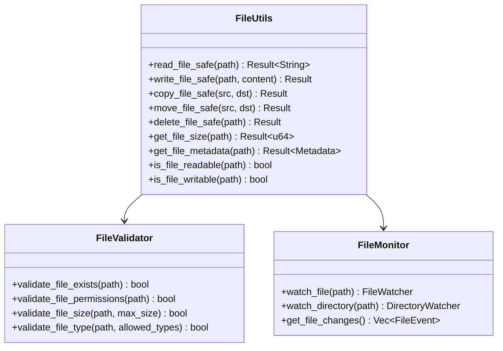

### Time Utilities

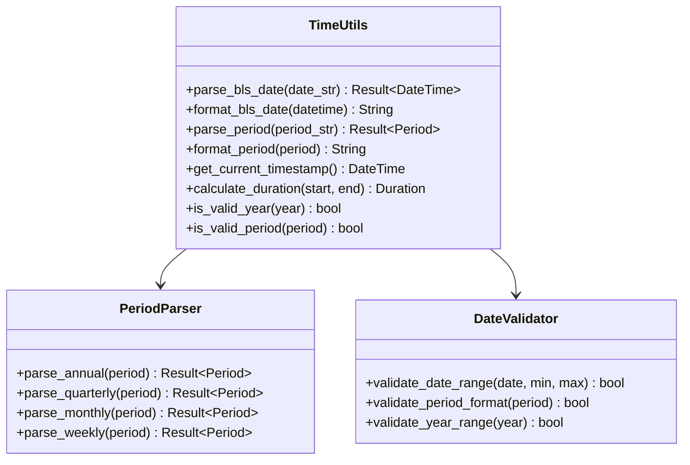

## Utility Workflows

### File Processing Workflow

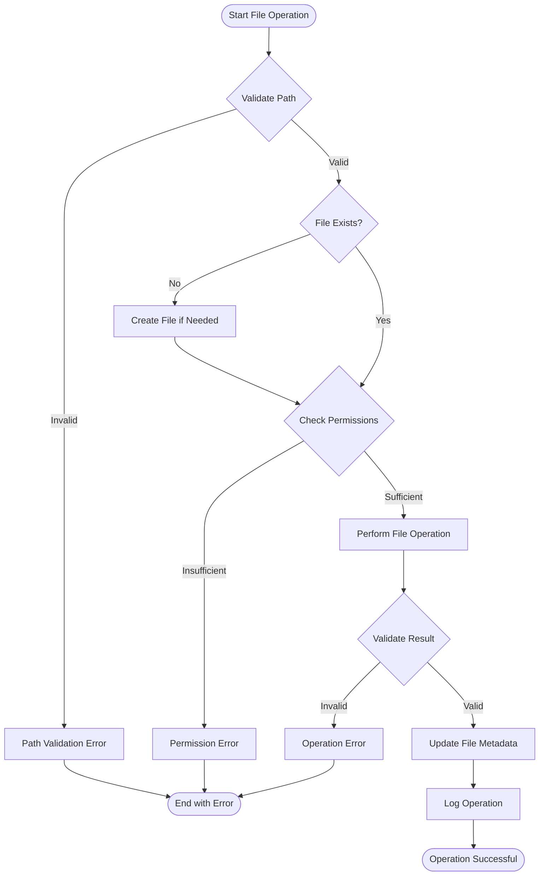

### Data Validation Workflow

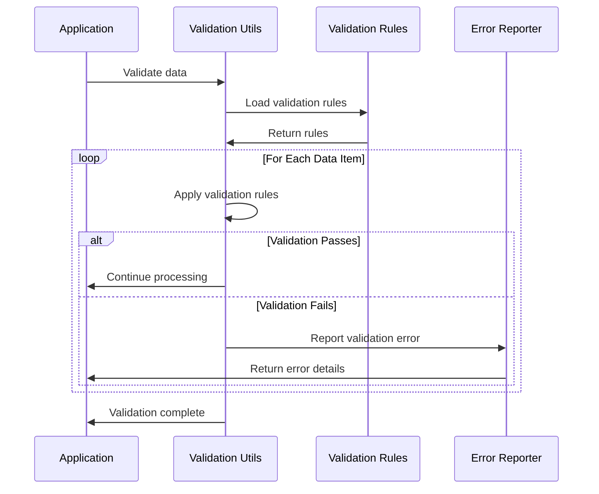

### System Resource Monitoring

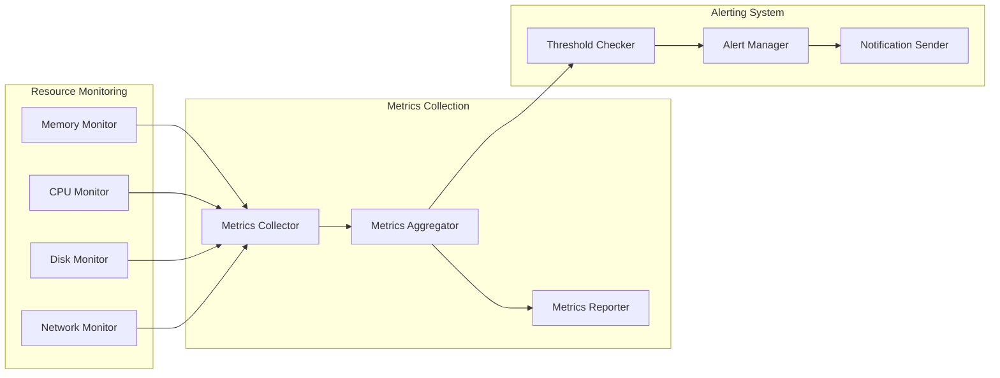

## Key Features

### 🛡️ Safety and Security
- **Path Validation**: Comprehensive path safety checks and validation
- **File Permissions**: Proper file permission handling and validation
- **Input Sanitization**: Sanitization of user inputs and file paths
- **Error Handling**: Robust error handling for all utility operations

### ⚡ Performance Optimization
- **Caching**: Intelligent caching of frequently accessed data
- **Lazy Loading**: Lazy initialization of expensive resources
- **Memory Management**: Efficient memory usage patterns
- **Async Operations**: Non-blocking operations where appropriate

### 🔍 Comprehensive Validation
- **Data Validation**: Extensive data validation utilities
- **Format Validation**: Format checking for various data types
- **Range Validation**: Numeric and date range validation
- **Custom Validators**: Support for custom validation rules

### 📊 System Monitoring
- **Resource Monitoring**: Real-time system resource monitoring
- **Performance Metrics**: Collection and reporting of performance metrics
- **Health Checks**: System health monitoring and reporting
- **Alerting**: Configurable alerting for system issues

## Format Utilities

### Data Format Conversion

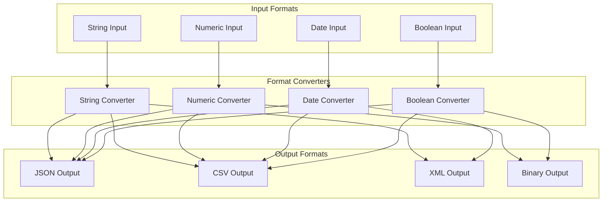

### String Processing Pipeline

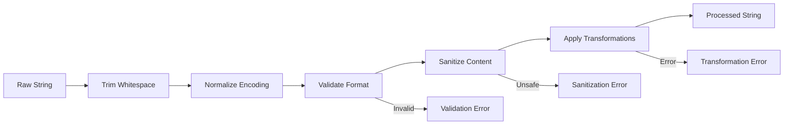

## Validation Utilities

### Validation Rule Engine

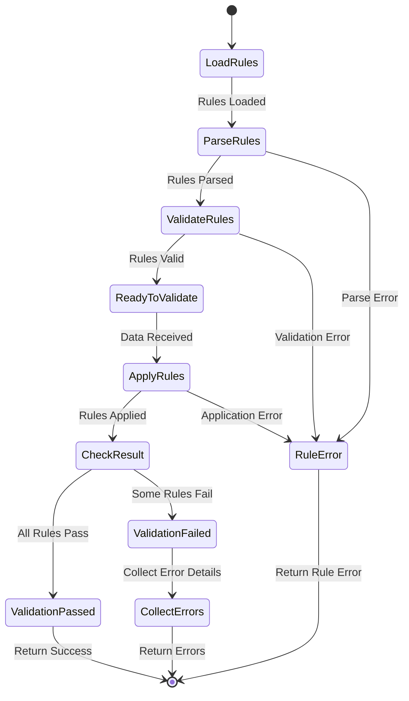

### Data Quality Assessment

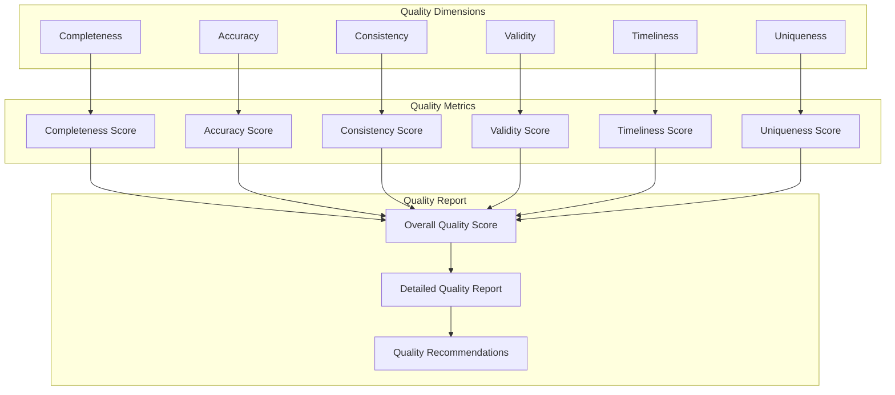

## Integration with Other Components

### Configuration System Integration
The Utilities component provides essential services to the Configuration System:
- Path resolution and validation for configuration files
- File reading and writing utilities for configuration persistence
- Validation utilities for configuration data
- Format conversion utilities for different configuration formats

### Data Layer Integration
The Utilities component supports the Data Layer with:
- File handling utilities for data file operations
- Data validation and format conversion utilities
- Time and date processing for BLS data formats
- Path utilities for data file organization

### Processing System Integration
The Utilities component assists the Processing System with:
- System resource monitoring for performance optimization
- Validation utilities for data quality checks
- Format conversion utilities for data transformations
- Time utilities for processing timestamps and durations

### Error Handling Integration
The Utilities component integrates with the Error Handling System:
- Provides detailed error context for utility operations
- Implements error recovery strategies for file operations
- Supports error logging and reporting
- Provides validation error details and suggestions

## Performance Considerations

### Memory Management
- Use memory pools for frequently allocated objects
- Implement lazy loading for expensive operations
- Cache frequently accessed data with appropriate expiration
- Monitor memory usage and optimize allocations

### I/O Optimization
- Use buffered I/O for file operations
- Implement async file operations where beneficial
- Optimize file access patterns
- Use memory mapping for large files when appropriate

### CPU Optimization
- Use efficient algorithms for data processing
- Implement parallel processing for independent operations
- Optimize string processing operations
- Use appropriate data structures for different use cases

## Testing Strategy

### Unit Tests
- Test individual utility functions in isolation
- Test edge cases and error conditions
- Test performance characteristics
- Test security and safety features

### Integration Tests
- Test utility integration with other components
- Test file operations with real file systems
- Test validation with real data
- Test system monitoring with real resources

### Performance Tests
- Benchmark utility function performance
- Test memory usage and optimization
- Test I/O performance and optimization
- Validate caching effectiveness

## Best Practices

### Safety and Security
- Always validate inputs before processing
- Use safe file operations with proper error handling
- Implement proper path validation to prevent traversal attacks
- Sanitize all user inputs and external data

### Performance
- Cache frequently accessed data appropriately
- Use lazy loading for expensive operations
- Optimize critical path operations
- Monitor and profile utility performance

### Error Handling
- Provide detailed error messages with context
- Implement appropriate error recovery strategies
- Log errors with sufficient detail for debugging
- Use proper error types for different error conditions

### Code Quality
- Write clear, self-documenting code
- Use appropriate abstractions and interfaces
- Follow consistent naming conventions
- Implement comprehensive tests

## Troubleshooting

### Common Issues

1. **File Operation Failures**
   - Check file permissions and ownership
   - Verify file paths are correct and accessible
   - Ensure sufficient disk space is available
   - Check for file locking issues

2. **Validation Failures**
   - Review validation rules and criteria
   - Check input data format and structure
   - Verify validation rule configuration
   - Test with known good data

3. **Performance Issues**
   - Profile utility function performance
   - Check for memory leaks or excessive allocations
   - Optimize I/O operations and file access patterns
   - Review caching strategies and effectiveness

4. **Path Resolution Issues**
   - Verify path format and structure
   - Check for path traversal attempts
   - Ensure proper path normalization
   - Test with different operating systems

## Contributing

When contributing to the Utilities component:

1. Follow existing patterns and conventions
2. Implement comprehensive error handling
3. Add appropriate validation and safety checks
4. Write tests for all utility functions
5. Document function behavior and edge cases
6. Consider performance implications
7. Ensure cross-platform compatibility where needed

## Further Reading

- [Path Utilities Reference](path_utils.md)
- [File Utilities Reference](file_utils.md)
- [Time Utilities Reference](time_utils.md)
- [Validation Utilities Reference](validation_utils.md)
- [Performance Optimization Guide](performance.md)

---

For questions about the Utilities component, please refer to the troubleshooting section or create an issue in the project repository.