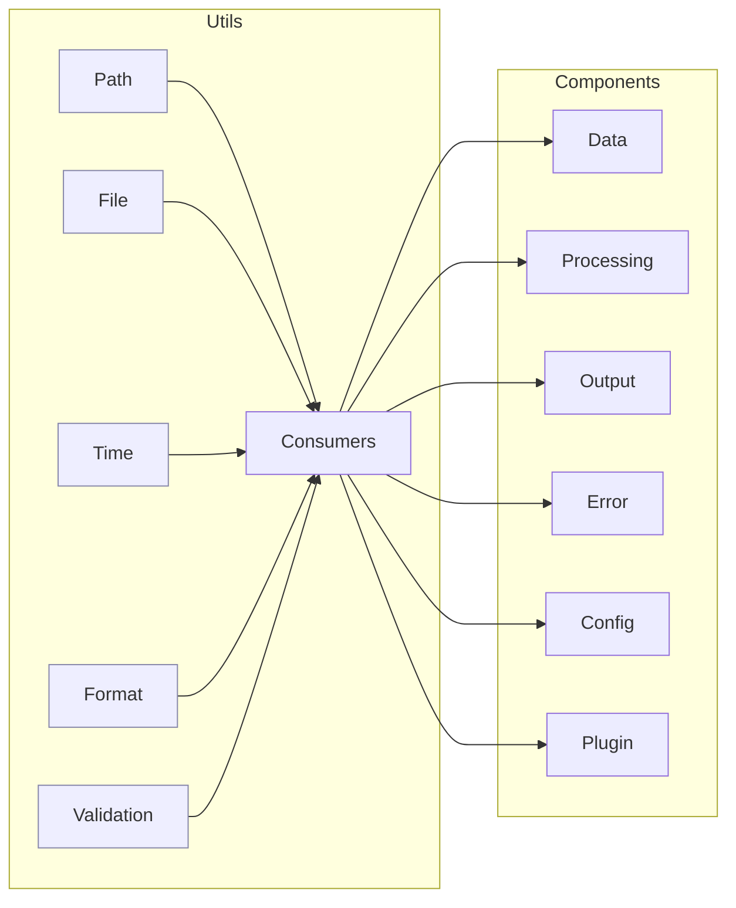

# Utils Module: Tasks and Roadmap

This document outlines the planned tasks and roadmap for the Utilities module. Utilities provide cross-cutting helpers for paths, files, time, formatting, and validation used throughout the system.

### At a Glance
- Packages: Path, File, Time, Format, Validation
- Role: Cross-cutting helpers for all components
- Guarantees: Lightweight, dependency-minimal, well-tested
- Status: Core Implementation phase

### Utilities in Context

## Current Status

Core utility modules exist (path, file, time, format, validation) with incremental enhancements planned to improve ergonomics and performance.

### Completed Tasks ✅
- Path utilities for cross-platform path handling
- File utilities for safe, atomic operations
- Time utilities for timestamps and durations
- Formatting helpers for human-readable output
- Validation helpers for common checks

### In Progress Tasks 🔄
- Rich validation error types and aggregation
- Performance profiling helpers (feature-gated)
- Extended path normalization and safe join

## Roadmap

### Phase 1: Reliability & Ergonomics (Weeks 1-2)
#### Task 1.1: Validation Extensions
- Priority: High • Effort: 3 days
- Deliverables: Aggregated validation results, error codes, helpful messages

#### Task 1.2: Path & File Safety
- Priority: High • Effort: 2 days
- Deliverables: Safer temp/atomic writes, secure directory creation

### Phase 2: Performance (Weeks 3-4)
#### Task 2.1: Zero-Cost Helpers
- Priority: Medium • Effort: 3 days
- Deliverables: Inlineable utilities, minimized allocations

#### Task 2.2: Time & Format Improvements
- Priority: Medium • Effort: 2 days
- Deliverables: Locale-aware formatting hooks, precise timers

### Phase 3: Testing & Docs (Weeks 5-6)
#### Task 3.1: Test Expansion
- Priority: High • Effort: 3 days
- Deliverables: Property-based tests, cross-platform path tests

#### Task 3.2: Documentation
- Priority: Medium • Effort: 2 days
- Deliverables: Usage examples and best practices

## Technical Debt
- Normalize error handling across modules
- Reduce hidden allocations in formatting utilities
- Consolidate duplicate path logic in consumers

## Dependencies
- Internal: Config, Data, Processing, Output, Error, Plugin
- External: Standard library preferred; keep third-parties optional

## Success Metrics
- 95%+ unit test coverage across utils
- Zero panics in utilities in production usage
- Documented, stable APIs with clear examples

---

### Navigation
- [Docs Home](../../index.md)
- [Component Index](../index.md)
- [Component README](README.md)
- [Test Specifications](test_specifications.md)
