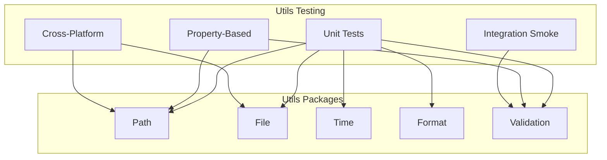

# Utils Module: Test Specifications

This document defines the testing strategy and concrete test specifications for the Utilities (Utils) module.

## Test Strategy Overview

Primary focus: fast, deterministic, cross-platform unit tests with strong property-based coverage for path and validation helpers.



## General Guidelines
- Keep tests hermetic: no network access, temp directories for file tests
- Use platform-agnostic assertions for paths (avoid hardcoded separators)
- Start debug prints with [DEBUG_LOG] for easier grep during CI
- Prefer Result-returning helpers in test code to allow `?` where possible

## Path Utilities Tests

### Specifications
- Normalization preserves semantics on Windows and Unix
- Joining prevents path traversal (`..`) when using safe join
- Relative <-> absolute conversions are idempotent where applicable

### Example Tests (Rust)
```rust
#[cfg(test)]
mod path_utils_tests {
    use super::*;

    #[test]
    fn safe_join_prevents_traversal() {
        let base = std::path::Path::new("/safe/base");
        let joined = crate::utils::path::safe_join(base, "../etc/passwd").unwrap();
        assert!(joined.starts_with(base), "must remain within base");
    }

    #[test]
    fn normalize_is_idempotent() {
        let p = "./a/./b/../c";
        let n1 = crate::utils::path::normalize(p);
        let n2 = crate::utils::path::normalize(&n1);
        assert_eq!(n1, n2);
    }
}
```

## File Utilities Tests

### Specifications
- Atomic write writes to temp then renames; partial writes do not corrupt destination
- Safe create ensures directory exists with correct permissions (best-effort cross-platform)
- Read/write round-trips with UTF-8 and binary content

### Example Tests
```rust
#[cfg(test)]
mod file_utils_tests {
    use super::*;
    use std::fs;

    #[test]
    fn atomic_write_roundtrip() {
        let dir = tempfile::tempdir().unwrap();
        let path = dir.path().join("out.txt");
        crate::utils::file::atomic_write(&path, b"hello").unwrap();
        let data = fs::read(&path).unwrap();
        assert_eq!(&data, b"hello");
    }
}
```

## Time Utilities Tests

### Specifications
- Duration formatting handles sub-second and large durations
- Monotonic timers are non-decreasing

### Example Tests
```rust
#[cfg(test)]
mod time_utils_tests {
    use super::*;

    #[test]
    fn monotonic_non_decreasing() {
        let t1 = crate::utils::time::now_monotonic();
        let t2 = crate::utils::time::now_monotonic();
        assert!(t2 >= t1);
    }
}
```

## Format Utilities Tests

### Specifications
- Human-readable size formatting matches expected thresholds (KB, MB, GB)
- Locale-aware hooks (if enabled) do not panic and format deterministically under test locale

## Validation Utilities Tests

### Specifications
- Aggregated validation collects all failures with codes and messages
- Common predicates (non_empty, in_range, is_code) behave as expected on edge cases

### Example Tests
```rust
#[cfg(test)]
mod validation_utils_tests {
    use super::*;

    #[test]
    fn non_empty_rejects_whitespace() {
        assert!(!crate::utils::validation::non_empty("   "));
        assert!(crate::utils::validation::non_empty("x"));
    }
}
```

## Performance Tests (Optional / Feature-Gated)
- Micro-benchmarks for hot-path helpers using `criterion` behind a `bench` feature

## Test Data and Fixtures
- Use `tempfile` for ephemeral directories
- Place any static fixture samples under tests/resources/ if needed

---

### Navigation
- [Docs Home](../../index.md)
- [Component Index](../index.md)
- [Utils README](README.md)
- [Utils Tasks](tasks.md)
