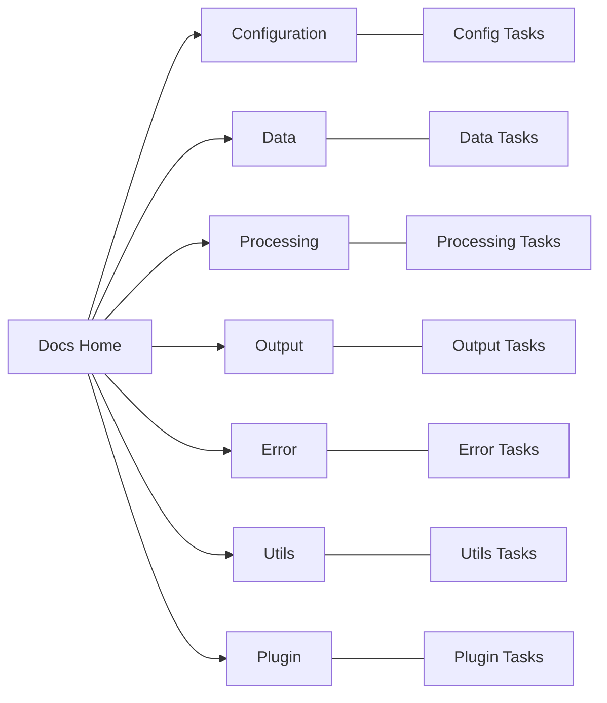

# Rusty BLS Documentation Home

Welcome to the Rusty BLS Data Processing documentation hub. Use this page to quickly navigate to component documentation, roadmaps, and test specifications.

## Visual Site Map

## Quick Navigation
- Component Index: components/index.md
- System Overview: README.md

## What to Read First
- New to Rusty? Start with README.md for a full architecture overview
- Want to see progress? Open any component’s tasks page
- Running tests? Check each component’s test_specifications.md

---

### Shortcuts
- Configuration: components/config/index.md | components/config/tasks.md
- Data: components/data/index.md | components/data/tasks.md
- Processing: components/processing/index.md | components/processing/tasks.md
- Output: components/output/index.md | components/output/tasks.md
- Error: components/error/index.md | components/error/tasks.md
- Plugin: components/plugin/index.md | components/plugin/tasks.md
- Utils: components/utils/index.md | components/utils/tasks.md
