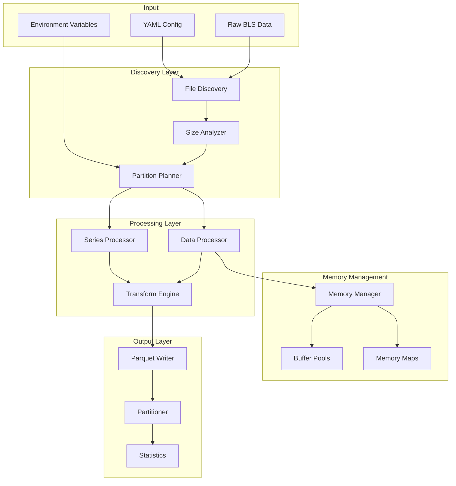

# BLS Data Processing System (Rust)

A high-performance, memory-efficient data processing system for 60+ Bureau of Labor Statistics surveys, capable of handling datasets from kilobytes to 5+ gigabytes using zero-copy streaming and intelligent partitioning.

## 🏗️ Architecture Overview



## 🚀 Key Features

- **Zero-Copy Processing**: Memory-mapped files and streaming iterators minimize memory usage
- **Adaptive Partitioning**: Intelligent splitting strategies based on file size and structure
- **Parallel Processing**: Multi-threaded execution with configurable thread pools
- **YAML-Driven**: Complete survey configuration without code changes
- **Memory Efficient**: Handles 5GB+ files with minimal memory footprint
- **Fault Tolerant**: Checkpoint-based recovery for long-running processes

## 📁 Project Structure

```
bls-processor/
├── Cargo.toml                    # Dependencies and workspace configuration
├── .env.example                  # Environment variable template
├── config/                       # Survey configurations
│   ├── template.yml             # Configuration template
│   ├── si.yml                   # Occupation Injuries survey
│   ├── sm.yml                   # State and Area Employment
│   └── ...                      # 60+ survey configs
├── src/
│   ├── main.rs                  # CLI entry point
│   ├── lib.rs                   # Library exports
│   ├── config/                  # Configuration management
│   │   ├── mod.rs
│   │   ├── loader.rs            # YAML loader
│   │   ├── validator.rs         # Config validation
│   │   └── schema.rs            # Config structures
│   ├── discovery/               # File discovery and analysis
│   │   ├── mod.rs
│   │   ├── scanner.rs           # File pattern matching
│   │   ├── analyzer.rs          # Size and structure analysis
│   │   └── validator.rs         # Schema validation
│   ├── partition/               # Partitioning strategies
│   │   ├── mod.rs
│   │   ├── planner.rs           # Partition planning
│   │   ├── strategies.rs        # Partitioning algorithms
│   │   └── splitter.rs          # File splitting logic
│   ├── processing/              # Core processing engine
│   │   ├── mod.rs
│   │   ├── series.rs            # Series file processor
│   │   ├── data.rs              # Data file processor
│   │   ├── streaming.rs         # Stream processing
│   │   └── parallel.rs          # Parallel execution
│   ├── transform/               # Data transformation
│   │   ├── mod.rs
│   │   ├── engine.rs            # Transformation engine
│   │   ├── expressions.rs       # Expression evaluator
│   │   ├── lookups.rs           # Lookup table joins
│   │   └── aggregations.rs      # Aggregation functions
│   ├── memory/                  # Memory management
│   │   ├── mod.rs
│   │   ├── manager.rs           # Memory manager
│   │   ├── pools.rs             # Buffer pools
│   │   ├── mmap.rs              # Memory-mapped files
│   │   └── monitor.rs           # Memory monitoring
│   ├── output/                  # Output generation
│   │   ├── mod.rs
│   │   ├── parquet.rs           # Parquet writer
│   │   ├── csv.rs               # CSV writer (optional)
│   │   ├── partitioner.rs       # Output partitioning
│   │   └── statistics.rs        # Column statistics
│   ├── metrics/                 # Performance monitoring
│   │   ├── mod.rs
│   │   ├── collector.rs         # Metrics collection
│   │   ├── reporter.rs          # Metrics reporting
│   │   └── profiler.rs          # Performance profiling
│   └── error/                   # Error handling
│       ├── mod.rs
│       ├── types.rs             # Error types
│       └── recovery.rs          # Recovery strategies
├── benches/                     # Performance benchmarks
│   ├── parsing.rs
│   ├── transformation.rs
│   └── partitioning.rs
├── tests/                       # Integration tests
│   ├── config_validation.rs
│   ├── large_file_processing.rs
│   └── survey_processing.rs
└── data/                        # Data directories
    ├── raw/                     # Raw BLS data
    │   └── bls/
    │       ├── si/
    │       ├── sm/
    │       └── ...
    ├── processed/               # Intermediate processing
    └── final/                   # Final Parquet output
```

## 🔧 Installation

### Prerequisites

- Rust 1.75+ (for async traits and const generics)
- 8GB+ RAM recommended for large files
- SSD storage for optimal performance

### Build from Source

```bash
# Clone repository
git clone https://github.com/yourusername/bls-processor.git
cd bls-processor

# Build release version
cargo build --release

# Run tests
cargo test

# Install globally (optional)
cargo install --path .
```

## ⚙️ Configuration

### Environment Variables

Create a `.env` file from the template:

```bash
cp .env.example .env
```

Key environment variables:

```bash
# Performance Tuning
BLS_MAX_THREADS=16               # CPU parallelization
BLS_MEMORY_LIMIT_GB=8            # Memory ceiling
BLS_CHUNK_SIZE_MB=256            # Processing chunk size

# Partitioning
BLS_PARTITION_THRESHOLD_GB=1.0   # Auto-partition threshold
BLS_PARTITION_STRATEGY=adaptive  # Partition strategy

# Output
BLS_OUTPUT_FORMAT=parquet         # Output format
BLS_COMPRESSION=snappy            # Compression algorithm
```

### Survey Configuration (YAML)

Example configuration for SI survey:

```yaml
main:
  code: si
  name: Occupation Injuries and Illness Incidences Rate Data
  description: Annual occupational safety statistics

processing:
  partition_strategy: adaptive
  compression: snappy
  enable_statistics: true
  max_row_group_size: 100000

file_patterns:
  series: "si.series"
  data: "si.data.*"
  lookups:
    - pattern: "si.*.txt"
      exclude: ["si.series", "si.data.*"]

data_structures:
  series:
    fields:
      - name: series_id
        type: string
        length: 17
        nullable: false
      - name: area_code
        type: string
        length: 5
      - name: industry_code
        type: string
        length: 6

transformations:
  - source: industry_code
    target: industry_name
    type: lookup
    table: industry
    key: code
    value: name

output:
  base_path: data/final/si
  partition_by: [year, division_code]
  format: parquet
  compression: snappy
```

## 🏃 Usage

### Basic Processing

```bash
# Process a single survey
bls-processor process --survey si

# Process with custom config
bls-processor process --survey si --config my-si-config.yml

# Process specific date range
bls-processor process --survey si --from 2020 --to 2024
```

### Advanced Options

```bash
# Dry run to validate configuration
bls-processor validate --survey si

# Process with progress monitoring
bls-processor process --survey si --progress

# Resume from checkpoint
bls-processor resume --checkpoint checkpoint-si-2024.json

# Process multiple surveys in parallel
bls-processor batch --surveys si,sm,tu,ap
```

### Programmatic Usage

```rust
use bls_processor::{SurveyProcessor, Config};

#[tokio::main]
async fn main() -> Result<(), Box<dyn std::error::Error>> {
    // Load configuration
    let config = Config::from_file("config/si.yml")?;
    
    // Create processor
    let processor = SurveyProcessor::new(config);
    
    // Process survey
    let metrics = processor
        .with_parallelism(16)
        .with_memory_limit_gb(8)
        .process()
        .await?;
    
    println!("Processed {} records in {:?}", 
             metrics.total_records, 
             metrics.elapsed);
    
    Ok(())
}
```

## 📊 Performance Characteristics

### Memory Usage

| File Size | Memory Usage | Strategy |
|-----------|-------------|----------|
| < 100MB   | ~2x file size | Full load |
| 100MB-1GB | 256MB constant | Streaming |
| 1GB-5GB   | 512MB constant | Partitioned streaming |
| > 5GB     | 1GB constant | Aggressive partitioning |

### Processing Speed

Benchmarks on typical hardware (16-core CPU, 32GB RAM, NVMe SSD):

| Survey | Data Size | Records | Time | Throughput |
|--------|-----------|---------|------|------------|
| SI     | 500MB     | 5M      | 8s   | 625 records/ms |
| SM     | 2GB       | 20M     | 35s  | 571 records/ms |
| TU     | 5GB       | 45M     | 95s  | 473 records/ms |

## 🔍 Monitoring

### Real-time Metrics

```bash
# Enable detailed metrics
export BLS_METRICS_INTERVAL_SEC=1
export BLS_LOG_LEVEL=debug

bls-processor process --survey si --metrics
```

Output:
```
[2024-01-15 10:23:45] Processing SI survey...
[2024-01-15 10:23:46] Discovered 15 files (5.2 GB total)
[2024-01-15 10:23:46] Partition strategy: Adaptive (target: 256MB)
[2024-01-15 10:23:46] Created 22 partitions
[2024-01-15 10:23:47] [■■■□□□□□□□] 30% | 1.56 GB | 425 MB/s | Memory: 487 MB
[2024-01-15 10:23:48] [■■■■■□□□□□] 50% | 2.60 GB | 520 MB/s | Memory: 502 MB
```

### Performance Profiling

```bash
# CPU profiling
cargo build --release --features profiling
perf record -F 99 target/release/bls-processor process --survey si
perf report

# Memory profiling
valgrind --tool=massif target/release/bls-processor process --survey si
ms_print massif.out.*
```

## 🛠️ Development

### Adding a New Survey

1. Create configuration file:
```bash
cp config/template.yml config/new_survey.yml
```

2. Define survey structure in YAML

3. Test configuration:
```bash
cargo test --test survey_validation -- new_survey
```

4. Process sample data:
```bash
bls-processor process --survey new_survey --limit 1000
```

### Running Tests

```bash
# Unit tests
cargo test

# Integration tests
cargo test --test '*'

# Benchmarks
cargo bench

# Property-based tests
cargo test --features proptest
```

## 📈 Optimization Tips

### For Maximum Speed
- Use NVMe SSD for I/O operations
- Increase thread count: `BLS_MAX_THREADS=32`
- Use snappy compression for balance
- Enable memory-mapped files: `BLS_ENABLE_MMAP=true`

### For Minimum Memory
- Reduce chunk size: `BLS_CHUNK_SIZE_MB=64`
- Lower buffer pool: `BLS_BUFFER_POOL_SIZE=4`
- Use aggressive partitioning: `BLS_PARTITION_THRESHOLD_GB=0.5`
- Disable statistics: `BLS_ENABLE_STATISTICS=false`

### For Reliability
- Enable checkpointing for long runs
- Use conservative memory limits
- Implement retry logic for network data
- Monitor system resources

## 🤝 Contributing

See [CONTRIBUTING.md](CONTRIBUTING.md) for development guidelines.

## 📄 License

MIT License - see [LICENSE](LICENSE) for details.

## 🔗 Related Projects

- [Arrow](https://arrow.apache.org/) - Columnar memory format
- [Parquet](https://parquet.apache.org/) - Columnar storage format
- [Tokio](https://tokio.rs/) - Async runtime for Rust

## 📚 Documentation

- [Architecture Deep Dive](docs/architecture.md)
- [Performance Tuning Guide](docs/performance.md)
- [Survey Configuration Reference](docs/configuration.md)
- [API Documentation](https://docs.rs/bls-processor)